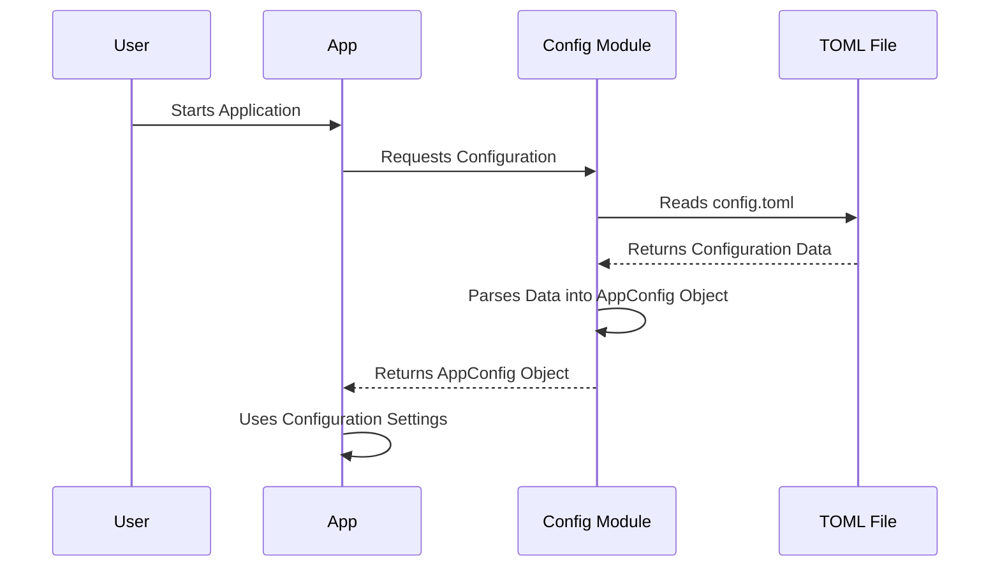

# Chapter 1: config

Welcome to the first chapter of the `Marnus_tutorial`! In this chapter, we'll be exploring the concept of "config." Think of the `config` as the control panel for our entire project, `OpenManus`. It's where we manage all the settings that determine how `OpenManus` behaves.

**Why do we need a config?**

Imagine you're building a robot that can answer questions using the internet. This robot needs to know:

*   Which "brain" (LLM - Large Language Model) to use to understand and generate answers (e.g., GPT-4, Llama 2).
*   How to access the internet to find information (e.g., which search engine to use).
*   Whether to use a browser with a visible window, or one that runs invisibly in the background.

The `config` is where we store all of this information. Without a `config`, we'd have to hardcode these settings directly into our code, which makes it difficult to change them later without rewriting parts of our application!

**Key Concepts:**

Let's break down what the `config` module actually *is*:

1.  **Settings:** These are individual pieces of information that control how `OpenManus` works. Examples include:
    *   LLM model name
    *   API keys for accessing services
    *   Browser settings (headless mode, etc.)

2.  **Configuration Files:** The settings are usually stored in a special file (like `config.toml`). This file is in a human-readable format that's easy to edit. TOML is used to manage hierarchical configs, which is a good way to structure and manage configurations.

3.  **Accessing Settings:** The `config` module provides a way for other parts of the `OpenManus` project to easily access these settings. Instead of searching for the settings in config files, other modules can call `config.llm`, `config.browser_config`, etc.

**A Simple Use Case: Setting the LLM model**

Let's say we want to tell `OpenManus` to use the "GPT-4" model. Here's how we'd do it using the `config`:

1.  **Edit the `config.toml` file:** Find the section related to LLMs. It might look something like this:

    ```toml
    [llm.default]
    model = "gpt-3.5-turbo" # originally it uses gpt-3.5-turbo.

    [llm.gpt4] # we can define different llm configs.
    model = "gpt-4" # it is a new config named "gpt4", with the model as "gpt-4".
    base_url = "your_api_endpoint"
    api_key = "your_api_key"
    api_type = "openai"
    api_version = "2023-07-01-preview"
    ```

2.  **Access the model name in the code:** In other parts of the `OpenManus` code, we can access the currently selected LLM's settings using `config.llm["gpt4"]`.

    ```python
    from app.config import config

    llm_model = config.llm["gpt4"].model # This will retrieve the model name.
    print(llm_model) # This will print "gpt-4"
    ```

    In this example, by simply calling `config.llm["gpt4"].model`, we are able to retrieve the `model` field from the configuration.

**Code Example: Accessing the Browser Configuration**

Let's say we want to know whether to run the browser in "headless" mode (i.e., without a visible window). Here's how we'd access that setting:

1.  **Check `config.toml`:** Verify the `browser` section is properly configured:

    ```toml
    [browser]
    headless = true # headless mode will be used if set as `true`.
    ```

2.  **Access the setting in the code:**

    ```python
    from app.config import config

    if config.browser_config and config.browser_config.headless: # need to verify browser config is defined, otherwise will cause runtime error.
        print("Running browser in headless mode")
    else:
        print("Running browser with a visible window")
    ```

**Under the Hood: How the Config Works**

Here's a simplified look at how the `config` module is implemented, using a sequence diagram:



1.  **Loading the Configuration:** When `OpenManus` starts, it asks the `Config Module` for the configuration settings.
2.  **Reading the TOML file:** The `Config Module` reads the `config.toml` file.
3.  **Parsing the data:** The `Config Module` parses the data from the `config.toml` file and creates an `AppConfig` object. The `AppConfig` object stores all the settings in an organized way.
4.  **Providing the Configuration:** The `Config Module` gives the `AppConfig` object to the rest of the `OpenManus` application.
5.  **Using the Settings:** The rest of the application can then access the settings from the `AppConfig` object.

**Code Deep Dive**

Let's look at a snippet of code from `app/config.py` that shows how the configuration is loaded:

```python
import tomllib
from pathlib import Path

def _get_config_path() -> Path:
    root = PROJECT_ROOT # PROJECT_ROOT is the root directory of our project.
    config_path = root / "config" / "config.toml" # locate the config.toml file.
    if config_path.exists():
        return config_path
    example_path = root / "config" / "config.example.toml" # if config.toml doesn't exist, fallback to example config file.
    if example_path.exists():
        return example_path
    raise FileNotFoundError("No configuration file found in config directory")

def _load_config() -> dict:
    config_path = _get_config_path()
    with config_path.open("rb") as f:
        return tomllib.load(f) # Use `tomllib` to read the TOML file.
```

This code first finds the `config.toml` file. If it exists, it reads the file using `tomllib` (a library for reading TOML files) and loads the configuration settings into a dictionary.

Another snippet shows how the settings are accessed by using `properties`.

```python
    @property
    def llm(self) -> Dict[str, LLMSettings]:
        return self._config.llm

    @property
    def browser_config(self) -> Optional[BrowserSettings]:
        return self._config.browser_config
```

Using the python's `@property` decorator, the calling of `config.llm` is equivalent to `config._config.llm`, so it can directly access the fields in `AppConfig` object.

**In Summary**

In this chapter, we've learned that the `config` module is essential for managing the settings of our `OpenManus` project. It allows us to easily change settings without modifying the core code. We looked at how to access settings and how the configuration is loaded and used internally.

Now that we understand the `config` module, we're ready to move on to the next chapter and explore the [BaseAgent](02_baseagent.md), which is the foundation for building our agents!


---

Generated by [AI Codebase Knowledge Builder](https://github.com/The-Pocket/Tutorial-Codebase-Knowledge)