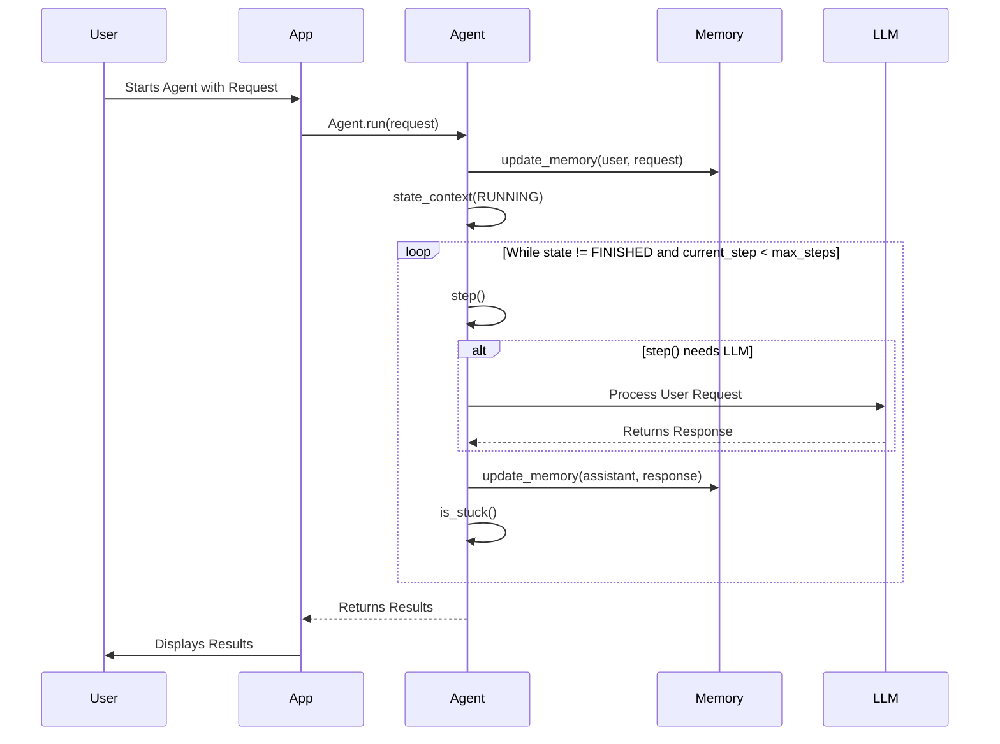

# Chapter 2: BaseAgent

Welcome back! In the previous chapter, [config](01_config.md), we learned how to manage application settings. Now, let's dive into the heart of our AI system: the `BaseAgent`.

**Why do we need a BaseAgent?**

Imagine we're building a team of AI assistants. One assistant helps with scheduling appointments, another writes code, and a third one summarizes news articles. Each assistant has its own specific tasks and abilities. But all of them need some common ground – a way to manage their "state" (are they working? finished?), remember what they've discussed (their "memory"), and use a "brain" (an LLM) to figure out what to do next.

That's where the `BaseAgent` comes in. It's a blueprint – a template – that defines the *essential* things every AI assistant needs. Think of it like a car chassis: it provides the fundamental structure, and each specific assistant (like our scheduler, coder, and summarizer) builds upon it with specialized components. Without `BaseAgent`, we'd be rewriting the same basic functionality for every single agent, which would be messy and inefficient!

**Key Concepts**

Let's break down the core concepts of the `BaseAgent`:

1.  **State Management:** An agent's "state" tells us what it's currently doing. Common states include:

    *   `IDLE`: The agent is waiting for instructions.
    *   `RUNNING`: The agent is actively working.
    *   `FINISHED`: The agent has completed its task.
    *   `ERROR`: Something went wrong.

    The `BaseAgent` provides a way to easily manage these states and ensure that agents transition between them safely.

2.  **Memory:** Agents need to remember what they've discussed and learned. This is where the "memory" comes in. The `BaseAgent` includes a `memory` component that stores the conversation history as a list of [Message](04_message.md) objects.

3.  **LLM Interaction:** The agent's "brain" is a Language Model (LLM). The `BaseAgent` has an LLM component that it uses to process information and make decisions. We'll explore the [LLM](03_llm.md) in more detail in the next chapter.

4.  **Steps and Execution:** Agents perform tasks in a series of steps. `BaseAgent` helps manage this step-by-step execution, setting limits (like `max_steps`) to prevent infinite loops.

**Using the BaseAgent**

Let's see how we can use the `BaseAgent`. First, we'll create a simple class that inherits from `BaseAgent`. This new class will represent a very basic agent that simply repeats the user's input.

```python
from app.agent.base import BaseAgent
from app.schema import AgentState


class EchoAgent(BaseAgent):
    async def step(self) -> str:
        """Echo back the latest user message."""
        user_message = self.memory.messages[-1].content # Get the latest user message.
        response = f"Echo: {user_message}"
        self.update_memory("assistant", response) # Add the response to memory.
        self.state = AgentState.FINISHED # Mark the agent as finished.
        return response
```

This `EchoAgent` overrides the `step` method, which defines what the agent does in each step. It retrieves the latest user message from memory, adds "Echo: " in front of it, saves the new message to its memory and marks the state as `FINISHED`.

Now, let's use this `EchoAgent`:

```python
import asyncio
from app.agent.base import AgentState
from app.agent.mcp import MCPAgent
from app.config import config
from app.agent.browser import BrowserAgent

async def main():
    agent = EchoAgent(name="EchoBot")
    result = await agent.run(request="Hello, world!")
    print(result)

if __name__ == "__main__":
    asyncio.run(main())
```

In this example:

1.  We create an instance of `EchoAgent` named "EchoBot".
2.  We call the `run` method with the initial user request "Hello, world!".
3.  The `run` method executes the agent's main loop. Inside the loop, the `step` method is called.
4.  The `step` method echoes back the user's message.
5.  The `run` method returns the result, which is then printed to the console.

The output will be something like:

```
Step 1: Echo: Hello, world!
```

Let's see a more complex example:

```python
import asyncio
from app.agent.base import AgentState
from app.agent.mcp import MCPAgent
from app.config import config
from app.agent.browser import BrowserAgent

async def main():
    agent = MCPAgent(name="MyTestAgent")
    result = await agent.run(request="What is the capital of the United States?")
    print(result)

if __name__ == "__main__":
    asyncio.run(main())
```

In this example, we are using `MCPAgent`, which is more complicated than `EchoAgent`. MCPAgent will leverage the [LLM](03_llm.md) we covered in the next chapter and tools to answer the question `What is the capital of the United States`.

**Under the Hood**

Let's explore what happens behind the scenes when we call the `run` method on a `BaseAgent`. Here's a simplified view:



1.  **The User initiates the process:** The user starts the agent with a request.
2.  **The App calls `Agent.run`:** The application calls the `run` method on the agent.
3.  **Memory is updated:** The agent updates its memory with the user's request.
4.  **State Transition:** The agent transitions to the `RUNNING` state using the `state_context` context manager.
5.  **Step-by-Step Execution:** The agent enters a loop, calling the `step` method repeatedly. If step() needs LLM, the agent calls LLM to process requests.
6.  **Memory is updated again:** After each step, the agent updates its memory with the response.
7.  **Stuck check:** After each step, the agent checks to see if it is stuck.
8.  **The loop continues:** The loop continues until the agent reaches the maximum number of steps or its state becomes `FINISHED`.
9.  **The App displays results:** Finally, the agent returns the results to the application, which displays them to the user.

Now, let's look at some code snippets from `app/agent/base.py` that implement this behavior:

```python
    async def run(self, request: Optional[str] = None) -> str:
        """Execute the agent's main loop asynchronously."""
        if self.state != AgentState.IDLE:
            raise RuntimeError(f"Cannot run agent from state: {self.state}")

        if request:
            self.update_memory("user", request)

        results: List[str] = []
        async with self.state_context(AgentState.RUNNING):
            while (
                self.current_step < self.max_steps and self.state != AgentState.FINISHED
            ):
                self.current_step += 1
                logger.info(f"Executing step {self.current_step}/{self.max_steps}")
                step_result = await self.step()
                results.append(f"Step {self.current_step}: {step_result}")

            if self.current_step >= self.max_steps:
                self.current_step = 0
                self.state = AgentState.IDLE
                results.append(f"Terminated: Reached max steps ({self.max_steps})")

        return "\n".join(results) if results else "No steps executed"
```

This code shows the main execution loop of the agent.

*   It first checks if the agent is in the correct `IDLE` state.
*   Then, if there's an initial request, it adds it to the agent's memory using `self.update_memory`.
*   The `async with self.state_context(AgentState.RUNNING):` block ensures that the agent's state is correctly set to `RUNNING` while the loop is executing. It'll also revert back to the previous state when exiting the block.
*   The `while` loop continues as long as the agent hasn't reached the maximum number of steps (`self.max_steps`) and its state isn't `FINISHED`.
*   Inside the loop, the `step` method is called, and the result is added to the `results` list.
*   Finally, the method returns a string containing the results of each step.

Another important part of the `BaseAgent` is the `update_memory` method:

```python
    def update_memory(
        self,
        role: ROLE_TYPE,  # type: ignore
        content: str,
        base64_image: Optional[str] = None,
        **kwargs,
    ) -> None:
        """Add a message to the agent's memory."""
        message_map = {
            "user": Message.user_message,
            "system": Message.system_message,
            "assistant": Message.assistant_message,
            "tool": lambda content, **kw: Message.tool_message(content, **kw),
        }

        if role not in message_map:
            raise ValueError(f"Unsupported message role: {role}")

        # Create message with appropriate parameters based on role
        kwargs = {"base64_image": base64_image, **(kwargs if role == "tool" else {})}
        self.memory.add_message(message_map[role](content, **kwargs))
```

This method adds a new [Message](04_message.md) to the agent's memory.

*   It takes the role of the message sender (e.g., "user", "assistant", "tool") and the content of the message as input.
*   It uses a `message_map` to create the appropriate type of message based on the role.
*   Finally, it adds the message to the agent's memory using `self.memory.add_message`.

**In Summary**

In this chapter, we've learned about the `BaseAgent`, which provides a foundational structure for all AI agents in our system. We explored its key concepts, including state management, memory, and LLM interaction. We saw how to create a simple agent by inheriting from `BaseAgent` and overriding the `step` method. We also delved into the internal implementation of the `BaseAgent` to understand how it manages the agent's execution loop and memory.

Now that we have a solid understanding of the `BaseAgent`, we're ready to move on to the next chapter and explore the [LLM](03_llm.md), which is the "brain" that powers our agents!


---

Generated by [AI Codebase Knowledge Builder](https://github.com/The-Pocket/Tutorial-Codebase-Knowledge)