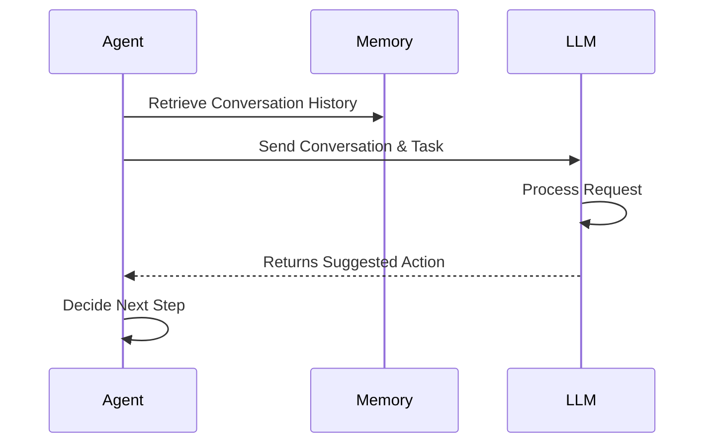

# Chapter 3: LLM

Welcome back! In the previous chapter, [BaseAgent](02_baseagent.md), we learned about the `BaseAgent`, which is the foundation for our AI agents. Now, let's talk about the "brain" that powers our agents: the LLM!

**Why do we need an LLM?**

Imagine you have a smart assistant, like Siri or Alexa. When you ask it a question, it doesn't just randomly guess an answer. It *understands* your question, *thinks* about it, and then gives you a helpful response.  This understanding and thinking comes from a Language Model, or LLM.

Think of it like this: An LLM is like the navigation system in a car.  The `BaseAgent` is the car itself, and the LLM is the navigation system that tells the car where to go and how to get there. It takes instructions (your requests), analyzes the situation (the current state of the agent), and guides the agent on the best route to achieve its objective (answering your question or completing a task).

**Key Concepts**

Let's break down the core concepts of the LLM:

1.  **Reasoning and Decision-Making:**  The LLM's main job is to help the agent make decisions. It does this by "reasoning" about the information it has.  For example, if you ask "What is the capital of France?", the LLM "reasons" that it needs to find information about France and its capital.

2.  **Inputs:** The LLM receives several inputs to help it make decisions:
    *   **Memory:**  What the agent has already learned or discussed (from the [Message](04_message.md) history, stored in the agent's memory).
    *   **Goals:**  What the agent is trying to achieve.
    *   **Available Tools:**  Things the agent can use to get information or take actions (like searching the internet, using a calculator, or controlling a browser).

3.  **Outputs:** The LLM's output is the next action the agent should take. This could be:
    *   A direct answer to a question.
    *   A command to use a tool (e.g., "search the web for 'capital of France'").
    *   A request for more information.

**Using the LLM**

Let's see how we can use the LLM. We'll use the `MCPAgent` (from the previous chapter) as an example.  The `MCPAgent` uses the LLM to answer questions.

Here's a simplified view of how the `MCPAgent` uses the LLM:

```python
from app.agent.mcp import MCPAgent
from app.config import config
import asyncio

async def main():
    # We will use the configurations defined in `config.toml`.
    # We are specifically using the default one.
    agent = MCPAgent(name="MyTestAgent")
    result = await agent.run(request="What is the capital of the United States?")
    print(result)

if __name__ == "__main__":
    asyncio.run(main())
```

In this example, the `MCPAgent` receives the request "What is the capital of the United States?".  It then uses the LLM to figure out how to answer the question. The LLM might decide that it needs to use a tool to search the internet.  It will then generate a command to use the search tool. The agent executes the tool, gets the result, and then uses the LLM again to formulate a final answer.

The `config.llm` tells `MCPAgent` which LLM to use.  If you recall from [config](01_config.md), this is defined in `config.toml`.

**Under the Hood**

Let's explore what happens behind the scenes when the agent calls the LLM. Here's a simplified view:



1.  **The Agent retrieves the conversation history:** The agent retrieves relevant information from its memory.
2.  **The Agent sends a request to the LLM:** The agent sends the conversation history, the current task, and any other relevant information to the LLM.
3.  **The LLM processes the request:** The LLM analyzes the information and determines the next action.
4.  **The LLM returns the suggested action:** The LLM returns a suggestion to the agent. The agent uses the suggestion to take the next step.

Now, let's look at some code snippets from `app/llm.py` that implement this behavior. Specifically, the `ask` method is the core logic to interact with the LLM.

```python
from typing import List, Union, Optional
from app.schema import Message

class LLM:
    # ... other methods ...

    async def ask(
        self,
        messages: List[Union[dict, Message]],
        system_msgs: Optional[List[Union[dict, Message]]] = None,
        stream: bool = True,
        temperature: Optional[float] = None,
    ) -> str:
        """
        Send a prompt to the LLM and get the response.
        """
        # format the messages, then send it to OpenAI to get the answer.
        # The code contains error handling and token limit handling.
        # We skip other implementation details.
        # The return value is the string the LLM answered.
        # ... implementation details ...
        return "The capital of the United States is Washington, D.C."
```

This code snippet shows the `ask` method, which is responsible for sending the messages to the LLM and receiving the response.  In reality, there are many implementation details (error handling, token management etc.) But the core logic is to send the formatted message to the LLM and retrieve the response.

In the real implementation, the `ask` method would format the messages to the expected structure, call the OpenAI or other LLM provider's API, and manage potential errors. But for simplicity, the result is mocked as "The capital of the United States is Washington, D.C.".

**In Summary**

In this chapter, we've learned about the LLM, which provides the reasoning and decision-making capabilities for our agents. We explored its key concepts, including reasoning, inputs, and outputs. We saw how the `MCPAgent` uses the LLM to answer questions. We also delved into the internal implementation of the `LLM` class to understand how it interacts with the LLM service.

Now that we have a solid understanding of the LLM, we're ready to move on to the next chapter and explore the [Message](04_message.md), which stores the conversation history between the agent and the user!


---

Generated by [AI Codebase Knowledge Builder](https://github.com/The-Pocket/Tutorial-Codebase-Knowledge)