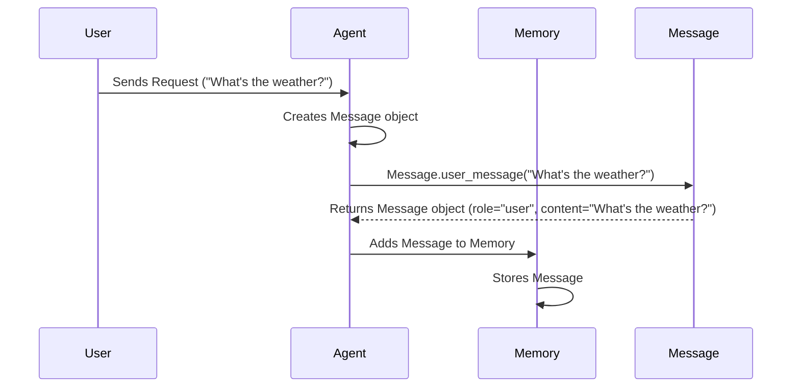

# Chapter 4: Message

Welcome back! In the previous chapter, [LLM](03_llm.md), we learned about the LLM, the "brain" that helps our agents make decisions. Now, let's focus on how agents communicate and remember what they've said: the `Message`!

**Why do we need a Message?**

Imagine you're chatting with a friend. You don't just shout random words at each other; you exchange messages! Each message has a sender (you or your friend), content (what you said), and maybe even some extra information (like if you used a funny GIF).

In our AI system, the `Message` does the same thing. It's how the agent, the user, and other tools communicate with each other. It keeps track of who said what, so the agent can remember the conversation and make better decisions. Think of it like an email: it contains all the necessary information for communication.

**Key Concepts**

Let's break down the core concepts of a `Message`:

1.  **Role:** This tells us who sent the message. It could be:
    *   `user`: A message from you, the user.
    *   `assistant`: A message from the AI agent.
    *   `system`: A message providing instructions to the agent (often hidden from the user).
    *   `tool`: A message from a tool the agent used (like a web search tool).

2.  **Content:** This is the actual text of the message - what was said.

3.  **Tool Calls (Optional):** Sometimes, the agent might use a tool to help answer a question.  This field records any tools that were used and what they did. For example, if the agent searches the web, this would be recorded as a tool call.

**Using the Message**

Let's see how we can use the `Message`. The primary way you'll interact with `Message` is indirectly, through the agent's memory. When the agent receives a request or generates a response, it creates a `Message` object and stores it in its memory.

Here's a simple example of how a `Message` might be created when a user sends a request to the agent:

```python
from app.schema import Message

user_message = Message.user_message(content="Hello, agent!")

print(user_message.role)
print(user_message.content)
```

In this example:

1.  We import the `Message` class.
2.  We use the `Message.user_message` factory method to create a new `Message` with the role "user" and the content "Hello, agent!".
3.  We print the role and content of the message to show what info is stored.

The output would be:

```
user
Hello, agent!
```

Here's another example, showing how the agent might respond:

```python
from app.schema import Message

agent_response = Message.assistant_message(content="Hello, user! How can I help you?")

print(agent_response.role)
print(agent_response.content)
```

The output would be:

```
assistant
Hello, user! How can I help you?
```

**Under the Hood**

Let's explore what happens behind the scenes when the agent receives a message and creates a `Message` object. Here's a simplified view:



1.  **The User sends a request:** The user sends a request to the agent.
2.  **The Agent creates a Message object:** The agent receives the request and creates a `Message` object to represent it.
3.  **The Message object is populated:** The `Message.user_message` method is called, which creates a new `Message` object with the role set to "user" and the content set to the user's request.
4.  **The Agent adds the Message to Memory:** The agent adds the new `Message` object to its memory.
5.  **The Memory stores the message:** The memory stores the message object for later usage.

Now, let's look at some code snippets from `app/schema.py` that implement this behavior:

```python
from pydantic import BaseModel, Field
from typing import Optional
from enum import Enum

class Role(str, Enum):
    """Message role options"""

    SYSTEM = "system"
    USER = "user"
    ASSISTANT = "assistant"
    TOOL = "tool"


class Message(BaseModel):
    """Represents a chat message in the conversation"""

    role: Role = Field(...)
    content: Optional[str] = Field(default=None)

    @classmethod
    def user_message(cls, content: str) -> "Message":
        """Create a user message"""
        return cls(role=Role.USER, content=content)

    @classmethod
    def assistant_message(cls, content: str) -> "Message":
        """Create an assistant message"""
        return cls(role=Role.ASSISTANT, content=content)
```

This code defines the `Message` class and its factory methods:

*   The `Message` class inherits from `BaseModel`, which provides basic functionality for creating and managing data objects.
*   The `role` field indicates the role of the message sender.
*   The `content` field contains the text of the message.
*   The `user_message` and `assistant_message` are "factory methods." These are special methods used to conveniently create `Message` objects with the correct role.

**In Summary**

In this chapter, we've learned about the `Message`, which is the fundamental unit of communication in our AI system. We explored its key concepts, including role, content, and tool calls. We saw how `Message` objects are created and used to store conversation history. We also delved into the internal implementation of the `Message` class to understand how it is defined and how messages are created.

Now that we have a solid understanding of the `Message`, we're ready to move on to the next chapter and explore the [Flow](05_flow.md), which orchestrates the interaction between agents!


---

Generated by [AI Codebase Knowledge Builder](https://github.com/The-Pocket/Tutorial-Codebase-Knowledge)