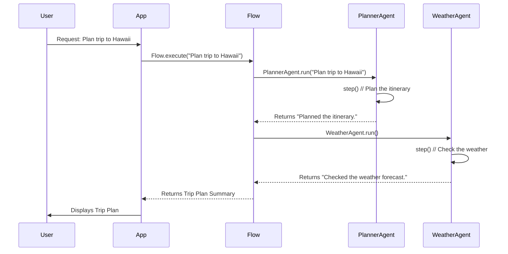

# Chapter 5: Flow

Welcome back! In the previous chapter, [Message](04_message.md), we learned how agents communicate and remember what they've said using `Message` objects. Now, let's learn how to orchestrate multiple agents to work together to achieve a complex goal: the `Flow`!

**Why do we need a Flow?**

Imagine you want to plan a trip. You might need several specialists: a travel agent to book flights and hotels, a weather forecaster to check the weather, and a local expert to recommend attractions. Each specialist has a specific role, and they need to work together to create the perfect trip plan.

In our AI system, a `Flow` does the same thing. It's like a project manager that coordinates multiple [BaseAgent](02_baseagent.md)s and [Tool](07_tool.md)s to achieve a complex objective. Think of it like an assembly line: each agent has a specific role and contributes to the final product. For example, one agent might be responsible for gathering information, another for planning the itinerary, and a third for making the bookings. Without `Flow`, we'd have to manually manage the interactions between these agents, which would be complex and error-prone!

**Key Concepts**

Let's break down the core concepts of a `Flow`:

1.  **Agents:** The individual [BaseAgent](02_baseagent.md)s that participate in the flow. Each agent has a specific role and expertise.

2.  **Tools:** The resources that the agents can use to achieve their objectives. These could be anything from search engines to databases to external APIs.

3.  **Primary Agent:** One agent is designated as the "primary" agent. This agent is responsible for initiating the flow and coordinating the activities of the other agents.

4.  **Execution:** The process of running the flow and coordinating the interaction between agents.

**Using the Flow**

Let's see how we can use the `Flow`. We'll use a hypothetical `PlanningFlow` as an example. This `Flow` is designed to plan a trip by coordinating a planner agent and a weather agent.

```python
from app.flow.flow_factory import FlowFactory, FlowType
from app.agent.base import BaseAgent

# Assume we have implemented `PlannerAgent` and `WeatherAgent` already.
# They both inherit from BaseAgent.
# from my_agents import PlannerAgent, WeatherAgent

# Dummy implementations for demonstration
class PlannerAgent(BaseAgent):
    async def step(self):
        return "Planned the itinerary."

class WeatherAgent(BaseAgent):
    async def step(self):
        return "Checked the weather forecast."

planner_agent = PlannerAgent(name="Planner")
weather_agent = WeatherAgent(name="Weather")

agents = {
    "planner": planner_agent,
    "weather": weather_agent,
}

# Create the PlanningFlow.
flow = FlowFactory.create_flow(
    flow_type=FlowType.PLANNING,
    agents=agents,
    primary_agent_key="planner"
)
```

In this example:

1.  We create two [BaseAgent](02_baseagent.md)s: a `PlannerAgent` and a `WeatherAgent`.  We use dummy implementations since the focus is on the `Flow` itself.
2.  We create a dictionary of agents, mapping a key to each agent instance.
3.  We use the `FlowFactory` to create a `PlanningFlow` instance, specifying the agent dictionary and designating "planner" as the primary agent.
4.  The `FlowFactory` uses the `FlowType.PLANNING` to determine which flow class to use.

Now, let's execute the flow:

```python
import asyncio

async def main():
    from app.flow.flow_factory import FlowFactory, FlowType
    from app.agent.base import BaseAgent

    # Assume we have implemented `PlannerAgent` and `WeatherAgent` already.
    # They both inherit from BaseAgent.
    # from my_agents import PlannerAgent, WeatherAgent

    # Dummy implementations for demonstration
    class PlannerAgent(BaseAgent):
        async def step(self):
            return "Planned the itinerary."

    class WeatherAgent(BaseAgent):
        async def step(self):
            return "Checked the weather forecast."

    planner_agent = PlannerAgent(name="Planner")
    weather_agent = WeatherAgent(name="Weather")

    agents = {
        "planner": planner_agent,
        "weather": weather_agent,
    }

    # Create the PlanningFlow.
    flow = FlowFactory.create_flow(
        flow_type=FlowType.PLANNING,
        agents=agents,
        primary_agent_key="planner"
    )
    result = await flow.execute(input_text="Plan a trip to Hawaii.")
    print(result)

if __name__ == "__main__":
    asyncio.run(main())
```

In this example, we call the `execute` method on the `PlanningFlow` instance, passing in the input text "Plan a trip to Hawaii.". The `execute` method will coordinate the activities of the `PlannerAgent` and the `WeatherAgent` to plan the trip. The output will likely be a string summarizing the plan.  Since we are using dummy agents, the output will be simple.

The exact output depends on the internal implementation of the `PlanningFlow`. A possible output can be:

```
Planned the itinerary.
Checked the weather forecast.
```

**Under the Hood**

Let's explore what happens behind the scenes when we call the `execute` method on a `Flow`. Here's a simplified view:



1.  **The User initiates the process:** The user sends a request to the application to plan a trip.
2.  **The App calls `Flow.execute`:** The application calls the `execute` method on the `Flow`, passing in the user's request.
3.  **The Flow orchestrates agents**: The `Flow` initiates the `PlannerAgent` to plan the itinerary.
4.  **The PlannerAgent plans**: The `PlannerAgent` executes its `step` method to plan the itinerary.
5.  **The Flow gets weather**: The `Flow` then initiates the `WeatherAgent` to check the weather forecast.
6.  **The WeatherAgent checks weather**: The `WeatherAgent` executes its `step` method to retrieve the weather forecast.
7.  **The App displays plan**: The `Flow` returns the trip plan summary to the application, which displays it to the user.

Now, let's look at some code snippets from `app/flow/base.py` that implement this behavior:

```python
from abc import ABC, abstractmethod
from typing import Dict, List, Optional, Union

from pydantic import BaseModel

from app.agent.base import BaseAgent


class BaseFlow(BaseModel, ABC):
    """Base class for execution flows supporting multiple agents"""

    agents: Dict[str, BaseAgent]
    tools: Optional[List] = None
    primary_agent_key: Optional[str] = None

    class Config:
        arbitrary_types_allowed = True

    @abstractmethod
    async def execute(self, input_text: str) -> str:
        """Execute the flow with given input"""
```

This code defines the `BaseFlow` class, which is the base class for all flows.

*   The `agents` field is a dictionary that maps agent keys to [BaseAgent](02_baseagent.md) instances.
*   The `tools` field is an optional list of [Tool](07_tool.md)s that the agents can use.
*   The `primary_agent_key` field specifies the key of the primary agent.
*   The `execute` method is an abstract method that must be implemented by subclasses. This method is responsible for executing the flow.

Here's a simplified example of an implementation of the `execute` method in `app/flow/planning.py` (simplified for clarity):

```python
from app.flow.base import BaseFlow

class PlanningFlow(BaseFlow):
    async def execute(self, input_text: str) -> str:
        """Execute the planning flow."""
        results = []
        planner_result = await self.primary_agent.run(input_text)
        results.append(planner_result)

        # Assuming a secondary agent 'weather' exists
        weather_agent = self.get_agent("weather")
        if weather_agent:
            weather_result = await weather_agent.run(input_text)
            results.append(weather_result)

        return "\n".join(results)
```

This code shows a simplified version of the `execute` method in `PlanningFlow`:

*   It first calls the `run` method on the primary agent (the planner).
*   Then, it retrieves the "weather" agent.
*   It calls the `run` method on the weather agent, and combines the results.
*   Finally, it returns a string containing the results of both agent calls.

**In Summary**

In this chapter, we've learned about the `Flow`, which provides a way to orchestrate multiple [BaseAgent](02_baseagent.md)s to achieve a complex objective. We explored its key concepts, including agents, tools, and execution. We saw how to create and execute a `Flow`. We also delved into the internal implementation of the `Flow` class to understand how it manages the interaction between agents.

Now that we have a solid understanding of the `Flow`, we're ready to move on to the next chapter and explore the [ToolCollection](06_toolcollection.md), which is a collection of tools for agents to use!


---

Generated by [AI Codebase Knowledge Builder](https://github.com/The-Pocket/Tutorial-Codebase-Knowledge)