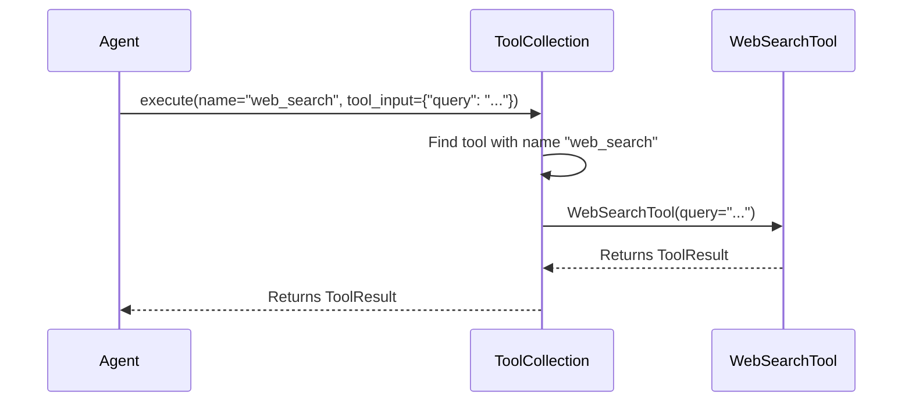

# Chapter 6: ToolCollection

Welcome back! In the previous chapter, [Flow](05_flow.md), we learned how to orchestrate multiple agents to work together. Now, let's talk about how we organize an agent's abilities using the `ToolCollection`!

**Why do we need a ToolCollection?**

Imagine a carpenter. They don't just have *one* tool, do they? They have a toolbox full of different tools, each designed for a specific task: a hammer for nails, a saw for cutting wood, a screwdriver for screws, and so on.

Similarly, an AI agent often needs many different "tools" to accomplish its goals. These tools could be things like:

*   A web search tool to find information online.
*   A calculator to perform calculations.
*   A browser controller to interact with websites.

The `ToolCollection` is like a toolbox for the agent. It's a way to organize and manage all the different [Tool](07_tool.md)s that an agent has access to. Without a `ToolCollection`, the agent would have to keep track of each tool individually, which would be messy and inefficient. It's like having all your tools scattered around the workshop instead of neatly organized in a toolbox!

**Key Concepts**

Let's break down the core concepts of the `ToolCollection`:

1.  **Tools:** The individual [Tool](07_tool.md) objects that the agent can use. Each tool has a specific name and functionality.
2.  **Organization:** The `ToolCollection` provides a way to organize tools into a single, manageable unit.
3.  **Execution:** The `ToolCollection` makes it easy to execute a tool by its name.

**Using the ToolCollection**

Let's say we want to create a `ToolCollection` for an agent that can search the web and perform calculations. First, we'll create some dummy tools (in a real application, these would be actual implementations):

```python
from app.tool.base import BaseTool, ToolResult, ToolFailure


class WebSearchTool(BaseTool):
    name = "web_search"
    description = "Searches the web for information."

    async def __call__(self, query: str) -> ToolResult:
        # In real app, search the web and return results
        return ToolResult(content=f"Web search results for: {query}")


class CalculatorTool(BaseTool):
    name = "calculator"
    description = "Performs calculations."

    async def __call__(self, expression: str) -> ToolResult:
        # In real app, evaluate the expression and return the result.
        return ToolResult(content=f"Result of: {expression}")

```

This code defines two simple tools: `WebSearchTool` and `CalculatorTool`. Each tool has a name, a description, and a `__call__` method that performs the tool's action. The `ToolResult` object wraps the result content.

Now, let's create a `ToolCollection` and add these tools to it:

```python
from app.tool.tool_collection import ToolCollection

web_search_tool = WebSearchTool()
calculator_tool = CalculatorTool()

tool_collection = ToolCollection(web_search_tool, calculator_tool)
```

This code creates a new `ToolCollection` and adds the `web_search_tool` and `calculator_tool` to it.

Now, let's execute a tool using the `ToolCollection`:

```python
import asyncio

async def main():
    from app.tool.tool_collection import ToolCollection
    from app.tool.base import BaseTool, ToolResult

    class WebSearchTool(BaseTool):
        name = "web_search"
        description = "Searches the web for information."

        async def __call__(self, query: str) -> ToolResult:
            return ToolResult(content=f"Web search results for: {query}")

    class CalculatorTool(BaseTool):
        name = "calculator"
        description = "Performs calculations."

        async def __call__(self, expression: str) -> ToolResult:
            return ToolResult(content=f"Result of: {expression}")

    web_search_tool = WebSearchTool()
    calculator_tool = CalculatorTool()

    tool_collection = ToolCollection(web_search_tool, calculator_tool)

    result = await tool_collection.execute(name="web_search", tool_input={"query": "What is the capital of France?"})
    print(result.content)

if __name__ == "__main__":
    asyncio.run(main())
```

This code executes the `web_search` tool with the input `{"query": "What is the capital of France?"}`. The `execute` method finds the tool with the name "web_search" in the `ToolCollection` and calls it with the provided input.

The output would be:

```
Web search results for: What is the capital of France?
```

**Under the Hood**

Let's explore what happens behind the scenes when we call the `execute` method on a `ToolCollection`. Here's a simplified view:



1.  **The Agent requests a tool execution:** The agent calls the `execute` method on the `ToolCollection`, specifying the name of the tool to execute and the input to pass to the tool.
2.  **The ToolCollection finds the tool:** The `ToolCollection` looks up the tool with the given name in its internal `tool_map`.
3.  **The ToolCollection executes the tool:** The `ToolCollection` calls the `__call__` method on the tool, passing in the provided input.
4.  **The Tool returns a result:** The tool performs its action and returns a `ToolResult` object containing the result.
5.  **The ToolCollection returns the result:** The `ToolCollection` returns the `ToolResult` object to the agent.

Now, let's look at some code snippets from `app/tool/tool_collection.py` that implement this behavior:

```python
class ToolCollection:
    """A collection of defined tools."""

    def __init__(self, *tools: BaseTool):
        self.tools = tools
        self.tool_map = {tool.name: tool for tool in tools}

    async def execute(
        self, *, name: str, tool_input: Dict[str, Any] = None
    ) -> ToolResult:
        tool = self.tool_map.get(name)
        if not tool:
            return ToolFailure(error=f"Tool {name} is invalid")
        try:
            result = await tool(**tool_input)
            return result
        except ToolError as e:
            return ToolFailure(error=e.message)
```

This code defines the `ToolCollection` class and its `execute` method:

*   The `__init__` method initializes the `ToolCollection` by storing the tools in a list (`self.tools`) and creating a dictionary (`self.tool_map`) that maps tool names to tool objects. This allows for fast lookups of tools by name.
*   The `execute` method takes the name of the tool to execute and an optional input dictionary as arguments.
*   It retrieves the tool object from the `tool_map` using the tool name.
*   If the tool is not found, it returns a `ToolFailure` object indicating that the tool is invalid.
*   Otherwise, it calls the `__call__` method on the tool, passing in the input dictionary as keyword arguments.
*   It returns the `ToolResult` object returned by the tool.

**In Summary**

In this chapter, we've learned about the `ToolCollection`, which provides a way to organize and manage the [Tool](07_tool.md)s that an agent can use. We explored its key concepts, including tools, organization, and execution. We saw how to create a `ToolCollection`, add tools to it, and execute tools using it. We also delved into the internal implementation of the `ToolCollection` class to understand how it manages the tools and executes them.

Now that we have a solid understanding of the `ToolCollection`, we're ready to move on to the next chapter and explore the [Tool](07_tool.md) itself, which defines the individual actions that an agent can take!


---

Generated by [AI Codebase Knowledge Builder](https://github.com/The-Pocket/Tutorial-Codebase-Knowledge)