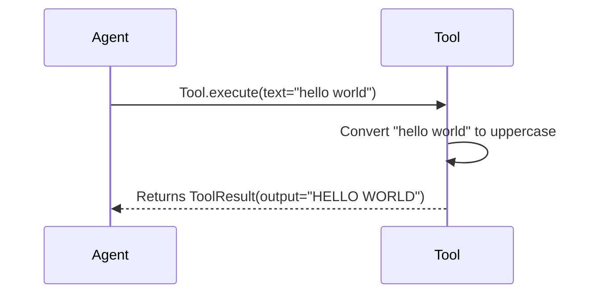

# Chapter 7: Tool

Welcome back! In the previous chapter, [ToolCollection](06_toolcollection.md), we learned how to organize an agent's abilities into a "toolbox." Now, let's dive into what those individual tools *are*: the `Tool`!

**Why do we need a Tool?**

Think of a Swiss Army knife. It's a single object, but it contains many different tools: a knife blade, a screwdriver, a bottle opener, etc. Each tool has a specific purpose.

In our AI system, a `Tool` is similar. It's a specialized function or skill that an agent can use to achieve its goals. For example, an agent might have a "web search" tool to find information online, or a "calculator" tool to perform calculations.  The `Tool` provides a way for the agent to interact with the world and gather information or perform actions beyond its built-in reasoning abilities. Without tools, an agent is like a person who only has their brain, but no hands!

**Key Concepts**

Let's break down the core concepts of a `Tool`:

1.  **Name:** A unique identifier for the tool (e.g., "web_search", "calculator"). This is how the agent refers to the tool.

2.  **Description:** A human-readable explanation of what the tool does (e.g., "Searches the web for information.", "Performs calculations."). This helps the agent decide when to use the tool.

3.  **Parameters:** The inputs that the tool needs to perform its function.  For example, a "web search" tool might need a "query" parameter (the search term), while a "calculator" tool might need an "expression" parameter (the calculation to perform).

4.  **Execution:** The actual code that performs the tool's function. This is what happens when the agent "uses" the tool.

**Using the Tool**

Let's create a simple `Tool` that converts text to uppercase.

```python
from app.tool.base import BaseTool, ToolResult

class UppercaseTool(BaseTool):
    name = "uppercase"
    description = "Converts text to uppercase."

    async def execute(self, text: str) -> ToolResult:
        """Converts the input text to uppercase."""
        uppercase_text = text.upper()
        return ToolResult(output=uppercase_text)
```

This code defines a new `Tool` called `UppercaseTool`.

*   It has a `name` of "uppercase" and a `description` that explains what it does.
*   It overrides the `execute` method, which takes a `text` parameter as input.
*   The `execute` method converts the input text to uppercase and returns a `ToolResult` object containing the result. The `ToolResult` wraps the actual result.

Now, let's use this `Tool`:

```python
import asyncio
from app.tool.base import BaseTool, ToolResult

class UppercaseTool(BaseTool):
    name = "uppercase"
    description = "Converts text to uppercase."

    async def execute(self, text: str) -> ToolResult:
        """Converts the input text to uppercase."""
        uppercase_text = text.upper()
        return ToolResult(output=uppercase_text)

async def main():
    tool = UppercaseTool()
    result = await tool.execute(text="hello world")
    print(result.output)

if __name__ == "__main__":
    asyncio.run(main())
```

In this example:

1.  We create an instance of `UppercaseTool`.
2.  We call the `execute` method with the input "hello world".
3.  The `execute` method converts the text to uppercase and returns a `ToolResult` object.
4.  We print the `output` of the `ToolResult` object.

The output will be:

```
HELLO WORLD
```

**Under the Hood**

Let's explore what happens behind the scenes when an agent uses a `Tool`. Here's a simplified view:



1.  **The Agent calls `Tool.execute`:** The agent calls the `execute` method on the `Tool`, passing in the necessary parameters.
2.  **The Tool performs its action:** The `Tool` executes its logic, using the provided parameters.
3.  **The Tool returns a ToolResult:** The `Tool` returns a `ToolResult` object containing the result of its action. The `ToolResult` can contain `output`, `error`, and other related fields.

Now, let's look at some code snippets from `app/tool/base.py` that implement this behavior:

```python
from abc import ABC, abstractmethod
from typing import Any, Dict, Optional

from pydantic import BaseModel, Field


class BaseTool(ABC, BaseModel):
    name: str
    description: str
    parameters: Optional[dict] = None

    class Config:
        arbitrary_types_allowed = True

    async def __call__(self, **kwargs) -> Any:
        """Execute the tool with given parameters."""
        return await self.execute(**kwargs)

    @abstractmethod
    async def execute(self, **kwargs) -> Any:
        """Execute the tool with given parameters."""

class ToolResult(BaseModel):
    """Represents the result of a tool execution."""

    output: Any = Field(default=None)
    error: Optional[str] = Field(default=None)
    base64_image: Optional[str] = Field(default=None)
    system: Optional[str] = Field(default=None)

    class Config:
        arbitrary_types_allowed = True
```

This code defines the `BaseTool` class, which is the base class for all tools.

*   The `name` field stores the name of the tool.
*   The `description` field stores a description of the tool.
*   The `parameters` field can store information about the tool's expected inputs.
*   The `execute` method is an abstract method that must be implemented by subclasses. This method is responsible for executing the tool's logic.
*   The `__call__` method is a wrapper around the `execute` method. It allows the tool to be called like a function (e.g., `tool(text="hello")`).
*   The `ToolResult` class is a `BaseModel` that wraps the result of calling the tool, which has fields like `output` and `error`.

**In Summary**

In this chapter, we've learned about the `Tool`, which represents a specialized function or skill that an agent can use. We explored its key concepts, including name, description, parameters, and execution. We saw how to create a simple `Tool` and use it. We also delved into the internal implementation of the `Tool` class to understand how it is defined and how tools are executed.

Now that we have a solid understanding of the `Tool`, we're ready to move on to the next chapter and explore the [Sandbox](08_sandbox.md), which provides a secure environment for running potentially unsafe code!


---

Generated by [AI Codebase Knowledge Builder](https://github.com/The-Pocket/Tutorial-Codebase-Knowledge)