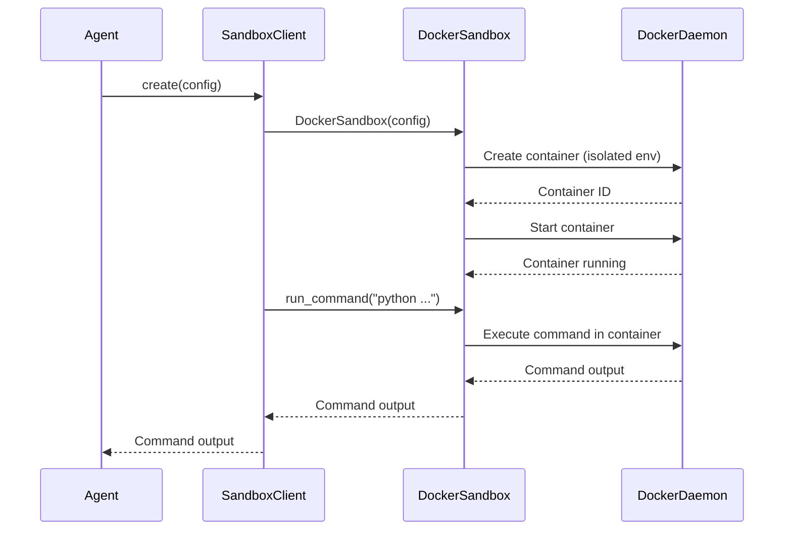

# Chapter 8: Sandbox

Welcome back! In the previous chapter, [Tool](07_tool.md), we explored how agents can use specialized tools to perform actions. Now, let's learn how to keep our system safe when those tools need to run potentially risky code: the `Sandbox`!

**Why do we need a Sandbox?**

Imagine you're letting your AI agent run code from the internet. That code *might* be harmless, but it could also be malicious! It could try to steal your data, crash your system, or do other nasty things.

The `Sandbox` is like a secure testing environment. It's a safe, isolated space where the agent can run code without affecting the rest of your system. Think of it like a virtual "playpen" where the agent can experiment and play with potentially dangerous code without breaking anything in the "real world."

Here's a central use case: You want your agent to be able to execute Python code snippets found online to solve math problems. However, you don't want this code to have access to your personal files or the ability to harm your computer. The `Sandbox` allows you to execute these snippets safely.

**Key Concepts**

Let's break down the core concepts of the `Sandbox`:

1.  **Isolation:** The `Sandbox` creates a barrier between the code running inside it and the rest of your system. This means the code in the `Sandbox` can't access your files, network, or other resources without explicit permission.

2.  **Resource Limits:** The `Sandbox` can limit the amount of resources (like CPU, memory, and disk space) that the code inside it can use. This prevents the code from hogging resources or crashing your system.

3.  **Security:** The `Sandbox` uses various security mechanisms to prevent the code inside it from escaping and compromising your system.

**Using the Sandbox**

Let's see how we can use the `Sandbox`. First, we'll create a `SandboxClient`. This client helps us interact with the `Sandbox`.

```python
from app.sandbox.client import create_sandbox_client

sandbox_client = create_sandbox_client()
```

This code creates a `SandboxClient` instance. The `create_sandbox_client` function handles the setup of the `Sandbox`.

Next, we need to create the `Sandbox` itself. Think of this as setting up the secure "playpen".

```python
import asyncio
from app.sandbox.client import create_sandbox_client
from app.config import config

async def main():
    sandbox_client = create_sandbox_client()

    # The configuration defines how the sandbox is set up, like memory limits.
    await sandbox_client.create(config=config.sandbox)

    # Now the sandbox is ready to use.
    print("Sandbox created successfully!")

if __name__ == "__main__":
    asyncio.run(main())
```

This code creates a `Sandbox` using the `create` method of the `SandboxClient`. It also loads the sandbox configuration from the global [config](01_config.md). The configuration (defined in `config.toml`) dictates aspects like the memory limit of the `Sandbox`.

Now, let's run a command inside the `Sandbox`:

```python
import asyncio
from app.sandbox.client import create_sandbox_client
from app.config import config

async def main():
    sandbox_client = create_sandbox_client()
    await sandbox_client.create(config=config.sandbox)

    # This command will be executed inside the secure environment.
    result = await sandbox_client.run_command("python -c 'print(2 + 2)'")
    print(f"Result from sandbox: {result}")

    await sandbox_client.cleanup() # Clean up the sandbox after use.

if __name__ == "__main__":
    asyncio.run(main())
```

In this example:

1.  We create a `Sandbox` as before.
2.  We call the `run_command` method on the `SandboxClient` with a Python command that calculates 2 + 2. This command is executed *inside* the `Sandbox`.
3.  We print the result returned by the `Sandbox`.
4.  We call `cleanup` to remove the `Sandbox` after we're done with it.

The output will be:

```
Result from sandbox: 4
```

Let's make it slightly more interesting, by writing a file to the sandbox:

```python
import asyncio
from app.sandbox.client import create_sandbox_client
from app.config import config

async def main():
    sandbox_client = create_sandbox_client()
    await sandbox_client.create(config=config.sandbox)

    # write a file inside the sandbox
    await sandbox_client.write_file(path="my_file.txt", content="Hello from the sandbox!")

    # read the file and print its content
    content = await sandbox_client.read_file(path="my_file.txt")
    print(f"Content of my_file.txt: {content}")

    await sandbox_client.cleanup() # Clean up the sandbox after use.

if __name__ == "__main__":
    asyncio.run(main())
```

The output will be:

```
Content of my_file.txt: Hello from the sandbox!
```

**Under the Hood**

Let's explore what happens behind the scenes when we create a `Sandbox` and run a command inside it.



1.  **The Agent asks to create the sandbox:** The agent calls the `create` method on the `SandboxClient`, providing the sandbox configuration.
2.  **The client talks to the DockerSandbox**: The `SandboxClient` creates a `DockerSandbox` object with the provided config.
3.  **The DockerSandbox creates a Docker container**: The `DockerSandbox` uses the Docker daemon to create a new, isolated container. This container is the actual `Sandbox`.
4.  **The DockerSandbox starts the container**: The `DockerSandbox` then starts the container.
5.  **The Agent asks to run a command:** The agent calls the `run_command` method on the `SandboxClient`, providing the command to execute.
6.  **The command is executed inside the container:** The `SandboxClient` forwards the command to the `DockerSandbox`, which executes it inside the Docker container.
7.  **The output is returned**: The output of the command is captured and returned to the agent through the `SandboxClient`.

Now, let's look at some code snippets from `app/sandbox/core/sandbox.py` and `app/sandbox/client.py` that implement this behavior.

Here's how the `DockerSandbox` is created in `app/sandbox/core/sandbox.py`:

```python
import docker

class DockerSandbox:
    def __init__(self, config, volume_bindings):
        self.config = config
        self.volume_bindings = volume_bindings
        self.client = docker.from_env() # Connect to the Docker daemon
        self.container = None

    async def create(self):
        # Prepare configurations for the container
        host_config = self.client.api.create_host_config(
            mem_limit=self.config.memory_limit,
            cpu_period=100000,
            cpu_quota=int(100000 * self.config.cpu_limit),
            network_mode="none" if not self.config.network_enabled else "bridge",
            binds=self._prepare_volume_bindings(),
        )

        # Create and start the container using the Docker API
        container = await asyncio.to_thread(
            self.client.api.create_container,
            image=self.config.image,
            command="tail -f /dev/null",
            hostname="sandbox",
            working_dir=self.config.work_dir,
            host_config=host_config,
            name=container_name,
            tty=True,
            detach=True,
        )

        self.container = self.client.containers.get(container["Id"])

        # Start container
        await asyncio.to_thread(self.container.start)
```

This code shows how the `DockerSandbox` connects to the Docker daemon, creates a container with specified resource limits and configurations, and starts the container.

Here's how the `LocalSandboxClient` interacts with the `DockerSandbox` in `app/sandbox/client.py`:

```python
from app.sandbox.core.sandbox import DockerSandbox

class LocalSandboxClient:
    def __init__(self):
        self.sandbox = None

    async def create(self, config, volume_bindings):
        self.sandbox = DockerSandbox(config, volume_bindings)
        await self.sandbox.create()

    async def run_command(self, command, timeout=None):
        if not self.sandbox:
            raise RuntimeError("Sandbox not initialized")
        return await self.sandbox.run_command(command, timeout)

    async def cleanup(self):
        if self.sandbox:
            await self.sandbox.cleanup()
            self.sandbox = None
```

This code shows how the `LocalSandboxClient` creates and manages the `DockerSandbox` and executes commands inside it. It acts as an intermediary between the agent and the Docker container.

**In Summary**

In this chapter, we've learned about the `Sandbox`, which provides a secure, isolated environment for running potentially unsafe code. We explored its key concepts, including isolation, resource limits, and security. We saw how to create a `Sandbox`, run commands inside it, and clean it up. We also delved into the internal implementation of the `Sandbox` using Docker to understand how it provides isolation and security.

With the `Sandbox`, our agents can now safely interact with the world and use external code without putting our systems at risk! Now that you have understood the components of `Marnus_tutorial`, you are encouraged to explore the codebase and implement some interesting features. This is the end of the tutorial.


---

Generated by [AI Codebase Knowledge Builder](https://github.com/The-Pocket/Tutorial-Codebase-Knowledge)