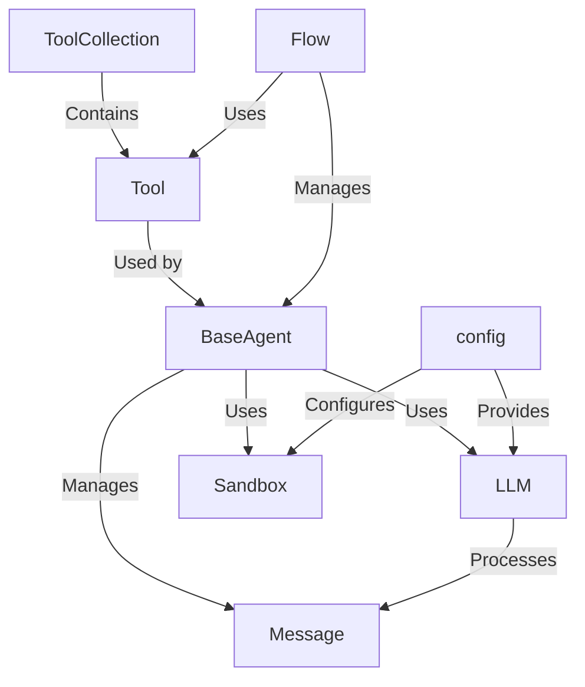

# Tutorial: Marnus_tutorial

The Marnus tutorial project creates **AI agents** capable of performing complex tasks. These agents use *Language Models* to reason and make decisions, leverage specialized *Tools* to interact with the external world, and work together in structured *Flows* to achieve objectives, all while being configured through a central *config* module and executing risky operations within a *Sandbox*. The agents communicate via *Messages*.

**Source Repository:** [https://github.com/mannaandpoem/OpenManus](https://github.com/mannaandpoem/OpenManus)

## Chapters

1. [config](01_config.md)
2. [BaseAgent](02_baseagent.md)
3. [LLM](03_llm.md)
4. [Message](04_message.md)
5. [Flow](05_flow.md)
6. [ToolCollection](06_toolcollection.md)
7. [Tool](07_tool.md)
8. [Sandbox](08_sandbox.md)

---

Generated by [AI Codebase Knowledge Builder](https://github.com/The-Pocket/Tutorial-Codebase-Knowledge)