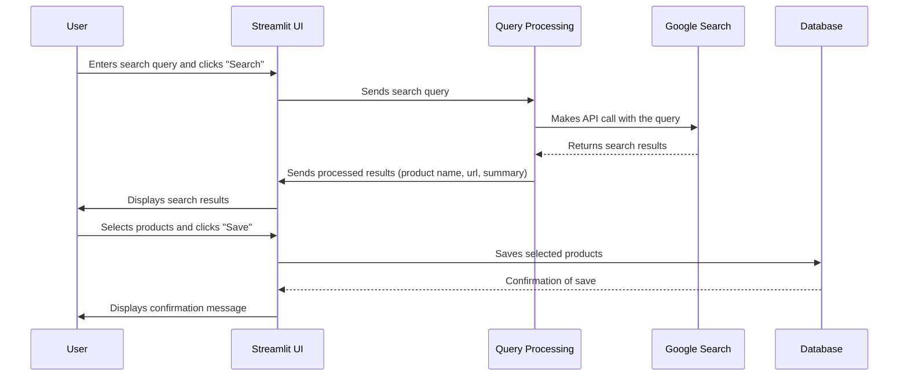

# Chapter 1: User Interface (Streamlit App)

Welcome to the first chapter of our tutorial! In this chapter, we'll be diving into the User Interface (UI) of our product search agent. Think of the UI as the dashboard of a car - it's how *you* interact with the powerful engine underneath. Without a good dashboard, even the fastest car is hard to drive!

**Why do we need a User Interface?**

Imagine you want to find "the best noise-cancelling headphones under $200". You could try to write a complex program every time you want to search, but that's not very user-friendly, is it?

A UI allows anyone to easily:

*   Enter what they are looking for (like our headphone example).
*   See the search results in a clear way.
*   Choose which products they want to save for later.
*   Manage their saved products (view, search, and delete).

In short, the UI makes our product search agent *accessible* and *easy to use* for everyone.

**Key Concepts**

Let's break down the main parts of our UI:

1.  **Input Field:** This is where you type in your product search query.  It's like the search bar on Google or Amazon.
2.  **Search Button:**  Clicking this tells the system to start searching for products based on your query.
3.  **Results Display:** This area shows the list of products found, with details like the product name, URL, and a short summary.
4.  **Save Feature:** A checkbox next to each product allows you to select products you want to save.
5.  **Database Management:** Allows you to see the products you have already saved and delete those that you don't want anymore.

**Using the UI: A Practical Example**

Let's go back to our "best noise-cancelling headphones under $200" example.  Here's how you'd use the UI:

1.  **Input:** You type "best noise-cancelling headphones under $200" into the input field.
2.  **Search:** You click the "Search" button.
3.  **Results:**  The UI will display a list of headphones that match your search, each with its name, a link to the product page, and a brief summary.
4.  **Save:** You see a pair of headphones you like and click the checkbox next to it. Then, you click the "Save Selected Products" button.
5.  **Database Management:** You can later go to the "Manage Saved Products" section to view or delete your saved headphones.

**The Code Behind the UI**

Our UI is built using a Python library called Streamlit. Streamlit makes it super easy to create interactive web apps with just a few lines of code. Let's look at a simplified version of our `interface.py` file:

```python
import streamlit as st

st.title("Autonomous Product Search Agent")

user_query = st.text_input("Enter your product query")

if st.button("Search"):
    st.write(f"You searched for: {user_query}")
```

Explanation:

*   `import streamlit as st`: This line imports the Streamlit library, which we'll use to build our UI.
*   `st.title("Autonomous Product Search Agent")`: This sets the title of our app, which will appear at the top of the page.
*   `user_query = st.text_input("Enter your product query")`: This creates a text input field where the user can type their search query. The text inside the parentheses is the label that appears next to the input field.
*   `if st.button("Search"):`: This creates a button labeled "Search". The code inside the `if` statement will only run when the button is clicked.
*   `st.write(f"You searched for: {user_query}")`: This displays the user's search query on the screen.

Imagine you type "laptops under $500" into the text box and click "Search".  The UI would then display "You searched for: laptops under $500".  Simple, right?

**Handling Search Results**

The next snippet shows how we display the results from the [Product Search Agent Core Logic](02_product_search_agent_core_logic.md) on the UI:

```python
# Assuming 'results' is a list of dictionaries, each representing a product
if st.session_state['results']:
    st.write("Results:")
    for product in st.session_state['results']:
        st.subheader(product['name'])
        st.write(f"URL: {product['url']}")
        st.write(f"Summary: {product['summary']}")
        st.write("---") # add a seperator between product
```

Explanation:

*   `if st.session_state['results']:`: This checks if there are any results to display.  `st.session_state` is a special Streamlit object that allows us to store data between user interactions. We will learn more about it in [Session State Management](09_session_state_management.md).
*   `st.write("Results:")`: This displays the word "Results:" above the list of products.
*   `for product in st.session_state['results']:`: This loops through each product in the `results` list.
*   `st.subheader(product['name'])`:  Displays the product's name as a subheader.
*   `st.write(f"URL: {product['url']}")`: Displays the product's URL.
*   `st.write(f"Summary: {product['summary']}")`: Displays a short summary of the product.

**Saving Products**

This snippet adds a checkbox that will allow the user to choose which products they want to save to the database:

```python
if st.session_state['results']:
    for i, product in enumerate(st.session_state['results']):
        # ... (previous code) ...
        if st.checkbox(f"Save this product ({product['name']})", key=f"save_{i}"):
            st.session_state['selected_to_save'].append(product)
```

Explanation:

*   `st.checkbox(f"Save this product ({product['name']})", key=f"save_{i}")`: Creates a checkbox with a label that says "Save this product (product name)". `key=f"save_{i}"` gives each checkbox a unique identifier, which is important for Streamlit to keep track of its state.
*   `st.session_state['selected_to_save'].append(product)`:  If the checkbox is checked, this line adds the corresponding product to a list called `selected_to_save`. This list will store the products the user wants to save.

**Internal Implementation**

Here's a simplified diagram of how the UI interacts with other parts of our system:



As you can see, the Streamlit UI acts as the central hub, connecting the user to the underlying search and storage functionalities.  The [Product Search Agent Core Logic](02_product_search_agent_core_logic.md) is responsible for communicating with external sources such as the [Google Search API Abstraction](04_google_search_api_abstraction.md), while the [Database Interaction](08_database_interaction.md) layer handles saving and retrieving product data.

**Conclusion**

In this chapter, we've learned about the importance of a User Interface and how it makes our product search agent accessible and easy to use. We explored the key components of our Streamlit app and saw how they work together to provide a seamless user experience. We also get a taste on how the UI interact with other parts like [Product Search Agent Core Logic](02_product_search_agent_core_logic.md) and [Database Interaction](08_database_interaction.md).

In the next chapter, we'll delve into the heart of our agent: [Product Search Agent Core Logic](02_product_search_agent_core_logic.md). We'll see how it takes your search query and turns it into a list of relevant products.


---

Generated by [AI Codebase Knowledge Builder](https://github.com/The-Pocket/Tutorial-Codebase-Knowledge)