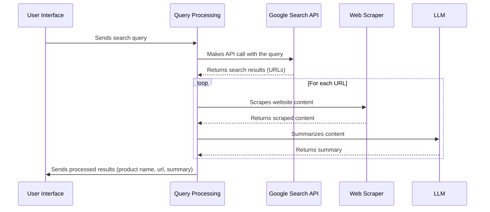

# Chapter 2: Product Search Agent Core Logic

Welcome back! In the [User Interface (Streamlit App)](01_user_interface__streamlit_app_.md) chapter, we built a simple app that lets you enter a search query and see the results. But *how* does the app actually find those results? That's where the "Product Search Agent Core Logic" comes in.

Imagine you want to find "the perfect gift for a friend who loves to cook". You wouldn't manually search every website, would you? The Product Search Agent Core Logic automates this process for you. It's the brain that takes your request, finds relevant information online, and summarizes it.

**Why do we need this Core Logic?**

*   **Automation:**  Instead of manually searching for products on different websites, the core logic automates this tedious task.
*   **Filtering and Summarization:** It sifts through mountains of information and gives you a concise summary of what's relevant.
*   **Centralization:** It provides a single point of access to product information from various sources.

**Key Concepts**

Let's break down the core logic into key steps:

1.  **Taking the Query:** The core logic receives your search query from the UI.
2.  **Searching the Web:** It uses the [Google Search API Abstraction](04_google_search_api_abstraction.md) (we'll talk about this more later!) to find relevant websites. Think of it as asking Google for help.
3.  **Scraping Websites:** Once it finds relevant websites, it "scrapes" the content. This means it extracts the text from those pages.
4.  **Summarizing Information:**  Finally, it uses a language model to summarize the information it scraped. This gives you a quick overview of the product.
5.  **Returning Results:**  The results, including the product name, URL, and summary, are then sent back to the UI for you to see.

**Using the Core Logic: A Practical Example**

Let's say you search for "best wireless earbuds under $100".

Here's what the core logic does:

1.  **Input:**  The query "best wireless earbuds under $100" is received.
2.  **Google Search:** It uses the [Google Search API Abstraction](04_google_search_api_abstraction.md) to search Google for relevant websites.
3.  **Website Scraping:** It visits the top search results and extracts the text from those pages.
4.  **Summarization:** It summarizes the information from each website, highlighting key features and reviews.
5.  **Output:**  It returns a list of products, each with a name, URL, and summary. For example:

    ```
    [
        {
            "name": "SoundPEATS TrueFree 2",
            "url": "https://www.amazon.com/SoundPEATS-TrueFree2-Wireless-Earphones-Bluetooth/dp/B08JQ2XFY7",
            "summary": "The SoundPEATS TrueFree 2 are waterproof wireless earbuds with deep bass and a comfortable fit."
        },
        {
            "name": "Anker Soundcore Life P2 Mini",
            "url": "https://us.soundcore.com/products/a3947",
            "summary": "The Anker Soundcore Life P2 Mini are small, lightweight earbuds with strong bass and a long battery life."
        }
    ]
    ```

**Code Example**

Here's a simplified version of how you might use the core logic:

```python
from main import process_query  # Assuming the core logic is in main.py

query = "best wireless earbuds under $100"
results = process_query(query)

for product in results:
    print(f"Product: {product['name']}")
    print(f"URL: {product['url']}")
    print(f"Summary: {product['summary']}\n")
```

Explanation:

*   `from main import process_query`:  This line imports the `process_query` function, which is the entry point to our core logic, from `main.py`.
*   `query = "best wireless earbuds under $100"`:  This sets the search query.
*   `results = process_query(query)`:  This calls the `process_query` function with our search query and stores the results in the `results` variable.
*   The `for` loop then iterates through the results and prints the product name, URL, and summary for each product.

**Internal Implementation**

Let's take a peek under the hood to see how the core logic works.

First, here's a diagram illustrating the process:



Explanation:

1.  The **User Interface** sends the search query to the **Query Processing** component (our core logic).
2.  The **Query Processing** component uses the **Google Search API** to get a list of relevant URLs.
3.  For each URL, the **Query Processing** component uses the **Web Scraper** to extract the content.
4.  The **Query Processing** component then sends the scraped content to the **LLM** (Large Language Model) to generate a summary.
5.  Finally, the **Query Processing** component sends the processed results (product name, URL, and summary) back to the **User Interface**.

Now, let's look at some code snippets from `main.py`:

```python
def process_query(query):
    # Simplify and limit the prompt to reduce token count
    simplified_prompt = f"Search for {query} and list URLs with brief summaries."
    search_results = google_search(query)

    products = []
    for item in search_results[:5]: # limit to top 5 results
        url = item['link']
        scraped_data = scrape_website(url)
        product = {
            "name": item.get('title', 'No title'),
            "url": url,
            "summary": scraped_data['summary']
        }
        products.append(product)
    return products
```

Explanation:

*   `def process_query(query):`: This defines the `process_query` function, which takes the search query as input.
*   `search_results = google_search(query)`: This calls the `google_search` function (from the [Google Search API Abstraction](04_google_search_api_abstraction.md) chapter) to get the search results.
*   The `for` loop iterates through the search results and extracts the URL and title of each result.
*   `scraped_data = scrape_website(url)`: This calls the `scrape_website` function (from the [Web Scraping and Summarization](05_web_scraping_and_summarization.md) chapter) to scrape the content of the website.
*   Finally, it creates a `product` dictionary with the name, URL, and summary and adds it to the `products` list.

The `google_search` function uses the Google Search API:

```python
from googleapiclient.discovery import build
import os
from dotenv import load_dotenv

load_dotenv()
GOOGLE_API_KEY = os.getenv("GOOGLE_API_KEY")
CSE_ID = os.getenv("CSE_ID")

def google_search(query):
    service = build("customsearch", "v1", developerKey=GOOGLE_API_KEY)
    response = service.cse().list(q=query, cx=CSE_ID).execute()
    return response.get('items', [])
```

Explanation:

*   This code snippet uses the Google Custom Search API to search the web.  You'll need to set up the API and get an API key, but we will dive deeper in that in the [Google Search API Abstraction](04_google_search_api_abstraction.md) chapter.
*   `build("customsearch", "v1", developerKey=GOOGLE_API_KEY)`: This line creates a service object that we can use to make API calls.
*   `service.cse().list(q=query, cx=CSE_ID).execute()`: This line makes the API call with the search query and returns the results.

The `scrape_website` function scrapes and summarizes the website:

```python
import requests
from bs4 import BeautifulSoup
from transformers import pipeline as hf_pipeline

summarizer = hf_pipeline("summarization", model="facebook/bart-large-cnn", device=-1)

def scrape_website(url):
    try:
        headers = {'User-Agent': 'Mozilla/5.0'}
        response = requests.get(url, headers=headers, timeout=10)
        soup = BeautifulSoup(response.text, 'html.parser')
        text = ' '.join(p.text for p in soup.find_all('p'))
        summary = summarizer(text, max_length=100, min_length=30)[0]['summary_text']
        return {"url": url, "summary": summary}
    except Exception as e:
        return {"url": url, "summary": f"Error: {str(e)}"}
```

Explanation:

*   This code snippet uses the `requests` library to fetch the HTML content of the website, then uses `BeautifulSoup` to parse the HTML and extract the text. It uses a Hugging Face summarization pipeline to create a summary of the extracted text. This will be explained further in the [Web Scraping and Summarization](05_web_scraping_and_summarization.md) chapter.

**Conclusion**

In this chapter, we've explored the core logic of our product search agent. We've seen how it takes a search query, uses the [Google Search API Abstraction](04_google_search_api_abstraction.md) to find relevant websites, scrapes those websites for content, and summarizes the information. We also looked at the internal implementation to understand how each step works.

In the next chapter, we'll discuss how to initialize the agent and configure it with the necessary tools: [Agent Initialization](03_agent_initialization.md).


---

Generated by [AI Codebase Knowledge Builder](https://github.com/The-Pocket/Tutorial-Codebase-Knowledge)