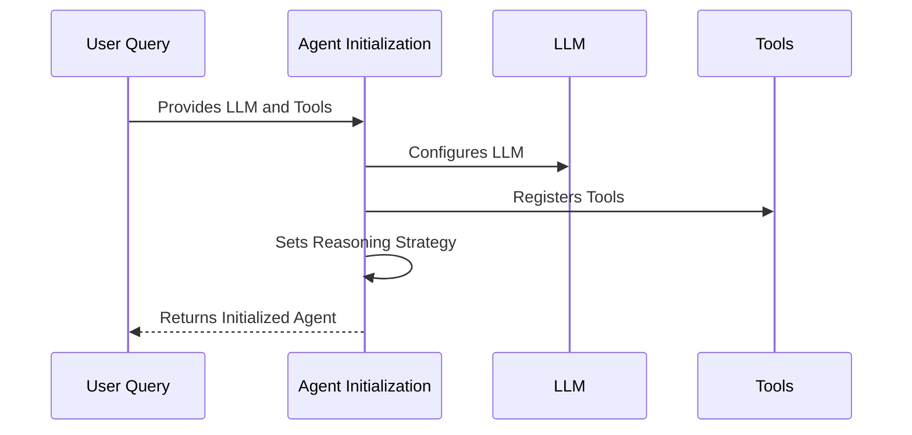

# Chapter 3: Agent Initialization

In the previous chapter, [Product Search Agent Core Logic](02_product_search_agent_core_logic.md), we learned how to build the core logic for our product search agent. Now, we're going to assemble all the pieces! This chapter will focus on "Agent Initialization," which is like building the brain and body that will coordinate everything.

Imagine you're building a robot chef. You have a cookbook (LLM), some kitchen tools (search, scrape), and a plan of action (reasoning strategy). Agent Initialization is the process of connecting these components to make a functioning chef robot.

**Why is Agent Initialization Important?**

Without proper initialization, our agent wouldn't know *how* to use its tools. It's like giving someone a hammer without telling them what nails are for. Agent initialization provides the agent with:

*   **An LLM (Large Language Model):** The "brains" that understand the user's request and decide what to do. We'll be using [LLM Abstraction (Mistral-8x7B-Instruct-v0.1)](06_llm_abstraction__mistral_8x7b_instruct_v0_1_.md) for this.
*   **Tools:** The resources the agent can use, like a search engine and a web scraper. We'll be using the [Google Search API Abstraction](04_google_search_api_abstraction.md) and [Web Scraping and Summarization](05_web_scraping_and_summarization.md).
*   **A Reasoning Strategy:**  A method for the agent to decide which tool to use in what order. Think of it as a flow chart.

**Key Concepts**

Let's break down what Agent Initialization actually *does*:

1.  **Defining Tools:** We tell the agent what tools it has access to (e.g., search, scrape).
2.  **Choosing an LLM:** We select the language model that will power the agent's reasoning.
3.  **Selecting an Agent Type:** We choose the specific strategy the agent will use to reason and act.

**Using Agent Initialization: A Practical Example**

Let's say a user asks: "Find me a good coffee maker under $50 with a timer."

Here's how the initialized agent would handle it:

1.  **Receive Query:** The agent receives the user's query.
2.  **Reasoning:** The agent uses its LLM to understand the query and decide which tool to use first. It might decide to use the "Google Search" tool to find coffee makers under $50.
3.  **Using Tools:** The agent uses the "Google Search" tool to search for "coffee makers under $50 with a timer".
4.  **Scraping Results:** After getting the results from the search, the agent might then use the "Web Scraper" to extract the important details from the search results (like price and timer functionality).
5.  **Response:**  Finally, the agent uses the LLM to format the information into a human-readable response and provides it to the user.

**Code Example**

Here's a simplified code snippet showing how to initialize the agent:

```python
from langchain.agents import initialize_agent
from langchain.tools import Tool

# Assume google_search and scrape_website are defined elsewhere
# These are tools we defined in previous chapters

# Define the tools the agent can use
tools = [
    Tool(
        name="Google Search",
        func=google_search,
        description="Searches the internet for product info."
    ),
    Tool(
        name="Web Scraper",
        func=scrape_website,
        description="Scrapes and summarizes content from a URL."
    )
]

# Initialize the LLM
# Assume llm is defined. This comes from our LLM Abstraction layer
llm = ...  # This will be replaced with Mistral in our project

# Initialize the agent
agent = initialize_agent(
    tools,
    llm,
    agent="zero-shot-react-description", # This is a reasoning strategy
    verbose=True # Set to True for debugging
)
```

Explanation:

*   `from langchain.agents import initialize_agent`: Imports the `initialize_agent` function, which is the main function for setting up our agent.
*   `from langchain.tools import Tool`: Imports the `Tool` class which is what our agent uses to access our functions.
*   `tools = [...]`: Defines a list of `Tool` objects. Each `Tool` has a `name`, a `func` (the function to call), and a `description` (what the tool does).
*   `llm = ...`:  This is where we define which Large Language Model we will use. For our project, this is the [LLM Abstraction (Mistral-8x7B-Instruct-v0.1)](06_llm_abstraction__mistral_8x7B_instruct_v0_1_.md).
*   `agent = initialize_agent(...)`:  This creates our agent! We pass in the `tools`, the `llm`, the `agent` type (reasoning strategy), and whether we want verbose output for debugging.

**Understanding the `agent` Parameter**

The `agent="zero-shot-react-description"` parameter is particularly important. It tells the agent *how* to reason. "Zero-shot" means the agent doesn't have any prior examples to learn from – it has to figure things out on its own. "REACT" stands for Reason, Act, Observe, and Think, which describes the steps the agent takes:

1.  **Reason:** The agent analyzes the user's input.
2.  **Act:** The agent decides which tool to use (e.g., Google Search).
3.  **Observe:** The agent observes the output of the tool (e.g., the search results).
4.  **Think:** The agent reflects on the results and decides what to do next.

This loop continues until the agent has found the answer or decided it can't.

**Internal Implementation**

Let's see what happens under the hood when we call `initialize_agent`.

First, here's a simplified sequence diagram:



Explanation:

1.  The **User Query** (that's us!) provides the **Agent Initialization** with the LLM and tools.
2.  **Agent Initialization** configures the **LLM** and registers the **Tools**.
3.  **Agent Initialization** sets the reasoning strategy (e.g., `zero-shot-react-description`).
4.  Finally, **Agent Initialization** returns the initialized agent, ready to process user queries.

Now, let's look at some code from `main.py` to see how this works in practice:

```python
from langchain.agents import initialize_agent

#Assume llm and tools are already defined as before

agent = initialize_agent(
    tools,
    llm,
    agent="zero-shot-react-description",
    verbose=True,
    handle_parsing_errors=True
)
```

Explanation:

*   The `initialize_agent` function takes the `tools`, `llm`, and other parameters to configure the agent.  It creates an `AgentExecutor` object internally. The `AgentExecutor` orchestrates the interaction between the LLM and the tools.
*   `handle_parsing_errors=True` handles any error that comes from the LLM, so the program doesn't crash.

**Using the Agent**

After initializing the agent, you can use it to process user queries:

```python
query = "Find me a good coffee maker under $50 with a timer."
response = agent.run(query)
print(response)
```

Explanation:

*   `agent.run(query)`:  This is the core part. It takes the user's query as input and runs the agent, which uses its LLM, tools, and reasoning strategy to find the answer.
*   `print(response)`:  This prints the agent's response to the console.

**Conclusion**

In this chapter, we've learned how to initialize our product search agent by connecting the LLM, tools, and reasoning strategy. We saw how the `initialize_agent` function brings all these components together. Now our agent is ready to process user queries and intelligently use its tools to find the best products!

In the next chapter, we'll take a closer look at the [Google Search API Abstraction](04_google_search_api_abstraction.md), which is one of the key tools our agent uses to find information online.


---

Generated by [AI Codebase Knowledge Builder](https://github.com/The-Pocket/Tutorial-Codebase-Knowledge)