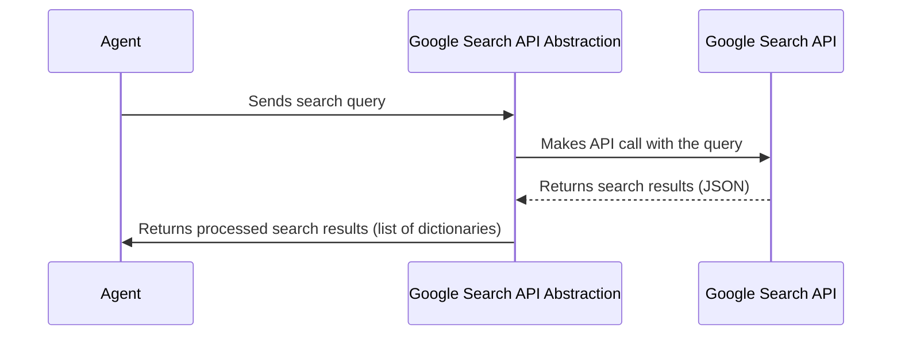

# Chapter 4: Google Search API Abstraction

In the previous chapter, [Agent Initialization](03_agent_initialization.md), we learned how to set up our agent by connecting its brain (LLM) and tools. Now, we're going to take a closer look at one of those essential tools: the Google Search API Abstraction.

Imagine you want to know "the best recipe for chocolate chip cookies." You probably wouldn't manually check *every* website on the internet, right? You'd use Google! This chapter is all about building a tool that allows our agent to do the same thing: to use Google to find the information it needs.

**Why do we need a Google Search API Abstraction?**

Our agent needs to be able to search the web. Google has a powerful API (Application Programming Interface) that lets us do this, but interacting with APIs directly can be a bit complicated. That's why we create an *abstraction*. Think of it like a simplified remote control for a complex TV. The remote control (abstraction) makes it easy to change channels without having to mess with all the wires and circuits inside the TV.

Specifically, this abstraction does the following:

*   **Provides Easy Access to Google Search:** It hides the complex details of interacting with Google's API.
*   **Formats Queries:** It takes a simple text query from our agent (like "best noise-canceling headphones under $100") and turns it into a format that Google understands.
*   **Parses Results:** It takes the search results that Google returns and extracts the important information (like website URLs and titles) in a way that our agent can easily use.

**Key Concepts**

Let's break down the key ideas behind our Google Search API Abstraction:

1.  **API (Application Programming Interface):** Think of an API as a waiter in a restaurant. You (the agent) tell the waiter (the API) what you want (a Google search). The waiter takes your order to the kitchen (Google's servers), gets the food (search results), and brings it back to you.

2.  **Abstraction:** This is the "simplified remote control" we talked about earlier. It hides the complicated details of using the API.

3.  **Query:** This is the question or request you want to ask Google. For example, "best affordable gaming laptops."

4.  **Search Results:** These are the list of websites that Google returns in response to your query.

**Using the Google Search API Abstraction: A Practical Example**

Let's say our agent wants to find "the best coffee grinder for French press." Here's how it would use our Google Search API Abstraction:

1.  **Input:** The agent gives the abstraction the query "best coffee grinder for French press."
2.  **Abstraction Does Its Thing:** The abstraction talks to Google's API, asking it to perform the search.
3.  **Output:** The abstraction returns a list of search results, like this (simplified):

    ```python
    [
        {
            "title": "The Best Coffee Grinders for French Press in 2024",
            "link": "https://www.example.com/best-coffee-grinders"
        },
        {
            "title": "How to Choose the Right Coffee Grinder for French Press",
            "link": "https://www.another-example.com/coffee-grinder-guide"
        }
    ]
    ```

**Code Example**

Here's a simplified version of how you might use the Google Search API Abstraction:

```python
from main import google_search #Assuming this is defined in main.py

query = "best coffee grinder for French press"
results = google_search(query)

for result in results:
    print(f"Title: {result['title']}")
    print(f"URL: {result['link']}")
    print("---")
```

Explanation:

*   `from main import google_search`: This line imports the `google_search` function from `main.py`.
*   `query = "best coffee grinder for French press"`: This sets the search query.
*   `results = google_search(query)`: This calls the `google_search` function with our search query and stores the results in the `results` variable.
*   The `for` loop then iterates through the results and prints the title and URL for each result.

**Setting Up the Google Search API**

Before our code works, we need to set up the Google Custom Search API. Here are the steps:

1.  **Get an API Key:** Go to the Google Cloud Console (console.cloud.google.com) and create a project. Enable the "Custom Search API" and get an API key. Google provides detailed documentation on this process.
2.  **Create a Custom Search Engine:** Go to the Google Custom Search Engine (cse.google.com) and create a search engine. You can configure it to search the entire web or specific websites. Get the CSE ID.
3.  **Set Environment Variables:** Store your API key and CSE ID as environment variables. This is more secure than hardcoding them into your script.

**Internal Implementation**

Let's take a peek under the hood to see how the Google Search API Abstraction works.

First, here's a diagram illustrating the process:



Explanation:

1.  The **Agent** sends the search query to the **Google Search API Abstraction**.
2.  The **Google Search API Abstraction** makes an API call to the **Google Search API**.
3.  The **Google Search API** returns the search results in JSON format.
4.  The **Google Search API Abstraction** processes the JSON and returns a list of dictionaries to the **Agent**, containing the title and link of each search result.

Now, let's look at the code from `main.py` to see how this works in practice:

```python
from googleapiclient.discovery import build
import os
from dotenv import load_dotenv

load_dotenv()
GOOGLE_API_KEY = os.getenv("GOOGLE_API_KEY")
CSE_ID = os.getenv("CSE_ID")

def google_search(query):
    service = build("customsearch", "v1", developerKey=GOOGLE_API_KEY)
    response = service.cse().list(q=query, cx=CSE_ID).execute()
    return response.get('items', [])
```

Explanation:

*   `from googleapiclient.discovery import build`: This line imports the `build` function from the `googleapiclient` library, which we use to interact with the Google Custom Search API.
*   `import os`: imports the `os` module, so we can work with operating system-dependent functionalities, like reading environment variables.
*   `from dotenv import load_dotenv`: imports `load_dotenv` from the `dotenv` library, allowing us to load environment variables from a `.env` file.
*   `load_dotenv()`: This loads the environment variables from the `.env` file. Make sure you have a `.env` file in the same directory as your script, with your API key and CSE ID defined:

    ```
    GOOGLE_API_KEY=YOUR_API_KEY
    CSE_ID=YOUR_CSE_ID
    ```

*   `GOOGLE_API_KEY = os.getenv("GOOGLE_API_KEY")`: This retrieves the Google API key from the environment variables.
*   `CSE_ID = os.getenv("CSE_ID")`: This retrieves the Custom Search Engine ID from the environment variables.
*   `def google_search(query):`: This defines the `google_search` function, which takes the search query as input.
*   `service = build("customsearch", "v1", developerKey=GOOGLE_API_KEY)`: This line creates a service object that we can use to make API calls to the Google Custom Search API. It specifies the API name (`customsearch`), the API version (`v1`), and our API key.
*   `response = service.cse().list(q=query, cx=CSE_ID).execute()`: This line makes the API call to search for the given query using our custom search engine.  `q=query` sets the search query, and `cx=CSE_ID` specifies the ID of our custom search engine. The `.execute()` method actually sends the request to Google.
*   `return response.get('items', [])`: This line extracts the search results from the API response. The `response.get('items', [])` part is a safe way to access the `'items'` key in the response. If the `'items'` key doesn't exist (for example, if there was an error), it returns an empty list (`[]`) instead of crashing the program.

**Conclusion**

In this chapter, we've built a Google Search API Abstraction that our agent can use to search the web. We've seen how it simplifies the process of interacting with Google's API and how it returns the important information in a format that our agent can easily use.

In the next chapter, we'll explore [Web Scraping and Summarization](05_web_scraping_and_summarization.md), another essential tool for extracting information from websites.


---

Generated by [AI Codebase Knowledge Builder](https://github.com/The-Pocket/Tutorial-Codebase-Knowledge)