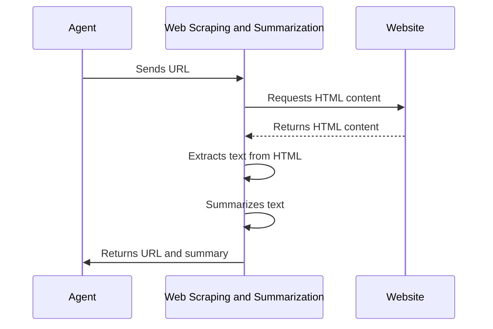

# Chapter 5: Web Scraping and Summarization

In the previous chapter, [Google Search API Abstraction](04_google_search_api_abstraction.md), we learned how our agent can use Google to find relevant websites. But finding the websites is only half the battle! Now we need to *read* those websites and understand what they're about. This chapter is all about "Web Scraping and Summarization."

Imagine you want to find the key features of a specific product mentioned on a website. You wouldn't manually read the entire webpage to find those details, would you? This chapter will show you how to build a robot that does that for you!

**Why do we need Web Scraping and Summarization?**

Think of it like this: the Google Search API gives us a list of doors to potentially interesting rooms (websites). Web Scraping and Summarization is like having a key to open the doors, go inside, quickly scan the room, and tell us the most important things inside.

Specifically, this abstraction:

*   **Extracts Text from Websites:** It "scrapes" the text content from a given URL. This is like reading the words on a webpage.
*   **Summarizes the Content:** It uses a language model to create a short summary of the scraped text. This is like getting a quick overview of what the webpage is about without having to read the whole thing.

**Key Concepts**

Let's break down the key ideas:

1.  **Web Scraping:** This is the process of automatically extracting data from websites. It's like copying and pasting the text from a webpage, but done automatically by a program.

2.  **HTML (HyperText Markup Language):** This is the language that websites are written in. It's like the structure of a document, with headings, paragraphs, and links.

3.  **Summarization:** This is the process of creating a shorter version of a text that contains the most important information.

**Using Web Scraping and Summarization: A Practical Example**

Let's say we have the URL of a product review website: `https://www.example.com/product-review`. Here's how we'd use our Web Scraping and Summarization abstraction:

1.  **Input:** We give the abstraction the URL: `https://www.example.com/product-review`.
2.  **Abstraction Does Its Thing:**
    *   It fetches the HTML content of the website.
    *   It extracts the text from the HTML.
    *   It summarizes the extracted text.
3.  **Output:** The abstraction returns a dictionary containing the original URL and a summary of the website's content:

    ```python
    {
        "url": "https://www.example.com/product-review",
        "summary": "This website reviews the latest SuperGizmo 3000.  It highlights the excellent battery life and improved camera, but notes that it's a bit pricey."
    }
    ```

**Code Example**

Here's a simplified version of how you might use the Web Scraping and Summarization abstraction (assuming its defined in `main.py`):

```python
from main import scrape_website

url = "https://www.example.com/product-review"
result = scrape_website(url)

print(f"URL: {result['url']}")
print(f"Summary: {result['summary']}")
```

Explanation:

*   `from main import scrape_website`: This line imports the `scrape_website` function from `main.py`.
*   `url = "https://www.example.com/product-review"`: This sets the URL of the website we want to scrape and summarize.
*   `result = scrape_website(url)`: This calls the `scrape_website` function with the URL and stores the result in the `result` variable.
*   The `print` statements then display the URL and the summary.

**Internal Implementation**

Let's take a peek under the hood.

First, here's a diagram:



Explanation:

1.  The **Agent** sends the URL to the **Web Scraping and Summarization** component.
2.  The **Web Scraping and Summarization** component requests the HTML content from the **Website**.
3.  The **Website** returns the HTML content.
4.  The **Web Scraping and Summarization** component extracts the text from the HTML.
5.  The **Web Scraping and Summarization** component summarizes the extracted text using a language model.
6.  Finally, the **Web Scraping and Summarization** component returns the URL and the summary to the **Agent**.

Now, let's look at the code from `main.py`:

```python
import requests
from bs4 import BeautifulSoup
from transformers import pipeline as hf_pipeline

summarizer = hf_pipeline("summarization", model="facebook/bart-large-cnn", device=-1)

def scrape_website(url):
    try:
        headers = {'User-Agent': 'Mozilla/5.0'}
        response = requests.get(url, headers=headers, timeout=10)
        soup = BeautifulSoup(response.text, 'html.parser')
        text = ' '.join(p.text for p in soup.find_all('p'))
        summary = summarizer(text, max_length=100, min_length=30)[0]['summary_text']
        return {"url": url, "summary": summary}
    except Exception as e:
        return {"url": url, "summary": f"Error: {str(e)}"}
```

Explanation:

*   `import requests`:  This imports the `requests` library, which allows us to fetch the HTML content of a website.
*   `from bs4 import BeautifulSoup`: This imports the `BeautifulSoup` class from the `bs4` library, which helps us parse the HTML and extract the text.
*   `from transformers import pipeline as hf_pipeline`: This imports the `pipeline` function from the `transformers` library, which allows us to use pre-trained language models for summarization.
*   `summarizer = hf_pipeline("summarization", model="facebook/bart-large-cnn", device=-1)`: This line initializes a summarization pipeline using the `facebook/bart-large-cnn` model. This model is specifically trained for summarizing text.
*   `def scrape_website(url):`: This defines the `scrape_website` function, which takes the URL of the website as input.
*   `headers = {'User-Agent': 'Mozilla/5.0'}`: This sets the `User-Agent` header in the HTTP request.  Some websites block requests from bots, so setting a `User-Agent` that looks like a real browser can help us avoid being blocked.
*   `response = requests.get(url, headers=headers, timeout=10)`: This line uses the `requests` library to fetch the HTML content of the website. The `timeout=10` means the request will be cancelled if it takes longer than 10 seconds.
*   `soup = BeautifulSoup(response.text, 'html.parser')`: This line creates a `BeautifulSoup` object from the HTML content. The `'html.parser'` argument tells BeautifulSoup to use Python's built-in HTML parser.
*   `text = ' '.join(p.text for p in soup.find_all('p'))`: This line extracts all the text from the `<p>` (paragraph) tags in the HTML and joins them together into a single string. This is a simple way to get the main content of the webpage.
*   `summary = summarizer(text, max_length=100, min_length=30)[0]['summary_text']`: This line uses the summarization pipeline to generate a summary of the extracted text. `max_length` and `min_length` control the length of the generated summary.
*   `return {"url": url, "summary": summary}`: This line returns a dictionary containing the original URL and the generated summary.
*   `except Exception as e:`: If something goes wrong during the process (e.g., the website doesn't exist, or we can't extract the text), this block will catch the error.
*   `return {"url": url, "summary": f"Error: {str(e)}"}`: This returns an error message if an exception occurs.

**Conclusion**

In this chapter, we've learned how to build a Web Scraping and Summarization abstraction. This allows our agent to automatically extract text from websites and create summaries of that text. This is a crucial step in understanding the information available online!

In the next chapter, we'll explore the [LLM Abstraction (Mistral-8x7B-Instruct-v0.1)](06_llm_abstraction__mistral_8x7b_instruct_v0_1_.md), which provides the "brains" for our agent to reason and make decisions.


---

Generated by [AI Codebase Knowledge Builder](https://github.com/The-Pocket/Tutorial-Codebase-Knowledge)