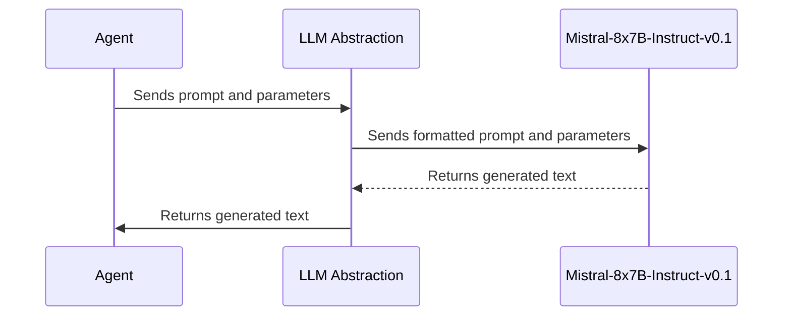

# Chapter 6: LLM Abstraction (Mistral-8x7B-Instruct-v0.1)

In the previous chapter, [Web Scraping and Summarization](05_web_scraping_and_summarization.md), we learned how to extract and summarize text from websites. Now, we're going to explore the "brain" that powers our product search agent: the LLM Abstraction!

Imagine you've gathered all the information about a product. You now need someone to understand and reason about this information. This is where the Large Language Model (LLM) comes in. Our LLM abstraction makes it easy to use powerful models like Mistral-8x7B-Instruct-v0.1. Think of it as plugging in a super-smart AI assistant that can understand what you're asking and help you find the best product.

**Why do we need an LLM Abstraction?**

Using an LLM directly can be complex. We need an abstraction to:

*   **Simplify LLM Interaction:**  It hides the details of interacting with the LLM, so you don't need to worry about the complicated code.
*   **Provide a Consistent Interface:** It provides a standard way to interact with *any* LLM, even if we decide to switch models later.
*   **Manage LLM Parameters:** It allows us to easily adjust settings like temperature and max tokens to control the LLM's behavior.

**Key Concepts**

Let's break down the key concepts behind our LLM Abstraction:

1.  **LLM (Large Language Model):** This is the AI model that understands and generates text. In our case, it's Mistral-8x7B-Instruct-v0.1. Think of it as a really smart computer program that can understand and respond to your questions.

2.  **Abstraction:** As we've seen in previous chapters, an abstraction simplifies complex interactions. Here, it simplifies interacting with the LLM.

3.  **Prompt:** This is the question or instruction we give to the LLM. For example, "Summarize this product review."

4.  **Parameters:** These are settings that control how the LLM generates text. For example, `temperature` controls how creative the LLM is, and `max_new_tokens` limits the length of the output.

**Using the LLM Abstraction: A Practical Example**

Let's say we want to use the LLM to summarize a product review. Here's how we'd use our LLM Abstraction:

1.  **Input:** We give the abstraction a prompt (the text to summarize) and any desired parameters.
2.  **Abstraction Does Its Thing:** The abstraction sends the prompt to the Mistral-8x7B-Instruct-v0.1 LLM, along with the specified parameters.
3.  **Output:** The abstraction returns the LLM's response (the summarized text).

**Code Example**

Here's a simplified example of how to use the LLM Abstraction (defined in `main.py`):

```python
from main import llm #Assuming llm is defined in main.py

prompt = "Summarize this product review: 'This phone has a great camera and long battery life.'"
response = llm.invoke(prompt)

print(response)
```

Explanation:

*   `from main import llm`: This line imports the `llm` object from `main.py`, which represents our LLM Abstraction.
*   `prompt = "Summarize this product review: 'This phone has a great camera and long battery life.'"`: This sets the prompt, which is the text we want the LLM to summarize.
*   `response = llm.invoke(prompt)`: This calls the LLM with our prompt and gets the response. The `invoke()` method is a way to send a query to the LLM.
*   `print(response)`: This prints the LLM's response to the console. The output will be a summary of the product review, such as "The phone has a great camera and long battery life."

**Internal Implementation**

Let's take a look under the hood.

Here's a diagram:



Explanation:

1.  The **Agent** sends the prompt (the text we want the LLM to process) and any parameters (like temperature or max tokens) to the **LLM Abstraction**.
2.  The **LLM Abstraction** formats the prompt and parameters and sends them to the **Mistral-8x7B-Instruct-v0.1** LLM.
3.  The **Mistral-8x7B-Instruct-v0.1** LLM processes the prompt and generates text based on the parameters.
4.  The **Mistral-8x7B-Instruct-v0.1** LLM returns the generated text to the **LLM Abstraction**.
5.  The **LLM Abstraction** returns the generated text to the **Agent**.

Now, let's look at the code from `main.py`:

```python
from langchain_huggingface import HuggingFaceEndpoint
import os
from dotenv import load_dotenv

load_dotenv()
HUGGINGFACE_TOKEN = os.getenv("HUGGINGFACE_TOKEN")

# Initialize the LLM with Mistral-8x7B-Instruct-v0.1 via Inference API
llm = HuggingFaceEndpoint(
    repo_id="mistralai/Mixtral-8x7B-Instruct-v0.1",
    huggingfacehub_api_token=HUGGINGFACE_TOKEN,
    task="text-generation",
    max_new_tokens=100,  # Reduced to fit within context limit
    temperature=0.7,
    top_k=50
)
```

Explanation:

*   `from langchain_huggingface import HuggingFaceEndpoint`:  This imports the `HuggingFaceEndpoint` class from the `langchain_huggingface` library. This class allows us to easily interact with models hosted on the Hugging Face Hub.
*   `import os`: imports the `os` module, so we can work with operating system-dependent functionalities, like reading environment variables.
*   `from dotenv import load_dotenv`: imports `load_dotenv` from the `dotenv` library, allowing us to load environment variables from a `.env` file.
*   `load_dotenv()`: This loads the environment variables from the `.env` file. Make sure you have a `.env` file in the same directory as your script, with your Hugging Face token defined:

    ```
    HUGGINGFACE_TOKEN=YOUR_HUGGINGFACE_TOKEN
    ```
    You need a Hugging Face account and API key.

*   `HUGGINGFACE_TOKEN = os.getenv("HUGGINGFACE_TOKEN")`: This retrieves the Hugging Face API key from the environment variables. You need a Hugging Face account to get an API key.
*   `llm = HuggingFaceEndpoint(...)`: This creates an instance of the `HuggingFaceEndpoint` class, which represents our LLM abstraction.
    *   `repo_id="mistralai/Mixtral-8x7B-Instruct-v0.1"`: This specifies the model we want to use, which is Mistral-8x7B-Instruct-v0.1.
    *   `huggingfacehub_api_token=HUGGINGFACE_TOKEN`: This provides the API token that allows us to access the Hugging Face Inference API.
    *   `task="text-generation"`: This specifies the task we want the LLM to perform, which is text generation.
    *   `max_new_tokens=100`: This limits the length of the generated text to 100 tokens.  We limit the tokens for faster processing and less resource usage.
    *   `temperature=0.7`:  This controls the randomness of the generated text. A higher temperature will result in more creative and unpredictable text, while a lower temperature will result in more conservative and predictable text.
    *   `top_k=50`: This parameter limits the model to choose from the top 50 most likely words at each step of text generation.

**Conclusion**

In this chapter, we've learned about the LLM Abstraction and how it simplifies the process of using powerful language models like Mistral-8x7B-Instruct-v0.1. We've seen how it allows us to easily send prompts to the LLM and receive responses.

In the next chapter, we'll discuss the [Product Data Structure](07_product_data_structure.md), which defines how we store and organize product information.


---

Generated by [AI Codebase Knowledge Builder](https://github.com/The-Pocket/Tutorial-Codebase-Knowledge)