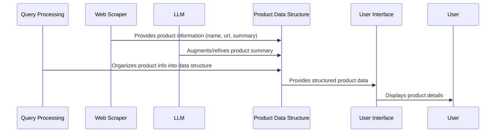

# Chapter 7: Product Data Structure

In the previous chapter, [LLM Abstraction (Mistral-8x7B-Instruct-v0.1)](06_llm_abstraction__mistral_8x7b_instruct_v0_1_.md), we learned how to use a Large Language Model (LLM) to understand and process information. Now, we need a way to organize the *results* of that processing. This chapter will cover the **Product Data Structure**.

Imagine you're searching for a new phone. You want to keep track of the phone's name, its website address (URL), and a short description (summary). The Product Data Structure is like a neat little container that holds all this information in one place for each phone you find. It's like having a consistent template for describing every product.

**Why do we need a Product Data Structure?**

Without a proper data structure, our agent wouldn't know *how* to organize the product information it finds. It's like having a bunch of puzzle pieces scattered around – we need a way to fit them together! The Product Data Structure provides:

*   **Organization:** It keeps all the product information (name, URL, summary) together in one place.
*   **Consistency:** It ensures that every product is described in the same way.
*   **Easy Access:** It allows us to easily access the product information when we need it (for example, to display it in the user interface or save it to a database).

**Key Concepts**

Let's break down the key ideas behind our Product Data Structure:

1.  **Data Structure:** Think of a data structure as a blueprint or a template for organizing information. It tells us what kind of information we need to store and how to store it.

2.  **Fields:** These are the individual pieces of information that we store about a product. In our case, we have three fields:
    *   `name`: The name of the product (e.g., "iPhone 15").
    *   `url`: The website address (URL) of the product (e.g., "https://www.apple.com/iphone-15").
    *   `summary`: A short description of the product (e.g., "The iPhone 15 has a great camera and long battery life.").

3.  **Dictionary (in Python):**  We'll use a Python dictionary to represent our Product Data Structure. A dictionary is like a real-world dictionary, where you have a word (the key) and its definition (the value). In our case, the keys will be the field names (`name`, `url`, `summary`), and the values will be the actual product information.

**Using the Product Data Structure: A Practical Example**

Let's say our agent has found information about a new pair of headphones. Here's how we'd use our Product Data Structure to store that information:

1.  **Create a Dictionary:** We create a Python dictionary to represent the product.
2.  **Populate the Fields:** We fill in the dictionary with the product's name, URL, and summary.

Here's what it would look like in code:

```python
product = {
    "name": "Sony WH-1000XM5",
    "url": "https://www.sony.com/headphones",
    "summary": "These headphones have excellent noise cancellation and great sound quality."
}
```

Explanation:

*   `product = { ... }`: This creates a Python dictionary and assigns it to the variable `product`.
*   `"name": "Sony WH-1000XM5"`: This sets the value of the `name` field to "Sony WH-1000XM5".
*   `"url": "https://www.sony.com/headphones"`: This sets the value of the `url` field to "https://www.sony.com/headphones".
*   `"summary": "These headphones have excellent noise cancellation and great sound quality."`: This sets the value of the `summary` field to "These headphones have excellent noise cancellation and great sound quality.".

Now, we can easily access the product information:

```python
print(f"Product Name: {product['name']}")
print(f"Product URL: {product['url']}")
print(f"Product Summary: {product['summary']}")
```

This code will print:

```
Product Name: Sony WH-1000XM5
Product URL: https://www.sony.com/headphones
Product Summary: These headphones have excellent noise cancellation and great sound quality.
```

**Internal Implementation**

The Product Data Structure is primarily a *conceptual* structure, defined by how we organize data within our code. It doesn't have a dedicated function or class that needs initialization, but rather is utilized in the other modules of the program.

Here's a sequence diagram illustrating how the Product Data Structure is used:



Explanation:

1.  The **Web Scraper** extracts the name, url and summary.
2.  The **LLM** refines or augments the summary.
3.  The **Query Processing** combines everything into the **Product Data Structure**.
4.  The **Product Data Structure** provides the User Interface with the structured product information.
5.  The **User Interface** displays all this product data to the user.

Let's look at the code snippets from `main.py` (previously mentioned in [Product Search Agent Core Logic](02_product_search_agent_core_logic.md)) to see how this works in practice:

```python
def process_query(query):
    # Simplify and limit the prompt to reduce token count
    simplified_prompt = f"Search for {query} and list URLs with brief summaries."
    response = agent.run(simplified_prompt)
    search_results = google_search(query)
    
    products = []
    for item in search_results[:5]:
        url = item['link']
        scraped_data = scrape_website(url)
        product = {
            "name": item.get('title', 'No title'),
            "url": url,
            "summary": scraped_data['summary']
        }
        products.append(product)
    return products
```

Explanation:

*   This code is inside the `process_query` function (from [Product Search Agent Core Logic](02_product_search_agent_core_logic.md)), which is responsible for orchestrating the search process.
*   `product = { ... }`: This creates a Python dictionary for each product found, adhering to our defined Product Data Structure. The keys of the dictionary (`name`, `url`, `summary`) are predefined to ensure every product is structured identically.
*   `products.append(product)`: This appends the `product` dictionary (containing product name, url and summary) to a `products` list. This list will then be used in the [User Interface (Streamlit App)](01_user_interface__streamlit_app_.md) to display search results.

**Conclusion**

In this chapter, we've learned about the Product Data Structure and how it helps us organize and store product information. We've seen how it provides organization, consistency, and easy access to product details. By using this data structure, we ensure that our product search agent can effectively manage and present the information it finds.

In the next chapter, we'll discuss [Database Interaction](08_database_interaction.md), which covers how to save and retrieve product data from a database.


---

Generated by [AI Codebase Knowledge Builder](https://github.com/The-Pocket/Tutorial-Codebase-Knowledge)