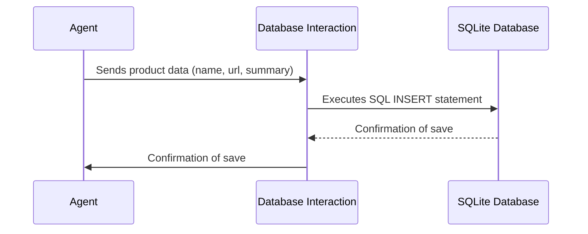

# Chapter 8: Database Interaction

In the previous chapter, [Product Data Structure](07_product_data_structure.md), we learned how to organize product information into a structured format. Now, let's talk about how to *remember* that information! This chapter is all about **Database Interaction**.

Imagine you've found the perfect laptop, and you want to save its details so you can easily find it again later. The Database Interaction component is like a digital filing cabinet where you can store this information. It's how our product search agent remembers the products you've found.

**Why do we need Database Interaction?**

Without a database, every time you close the app, all your saved products would be gone! Think of it like this:

*   **Persistence:** The database allows us to store product information permanently, even after the app is closed.
*   **Organization:** It helps us organize the saved products, so we can easily search, view, and delete them.
*   **Recall:** It enables us to retrieve previously saved products.

**Key Concepts**

Let's break down the key concepts:

1.  **Database:** A database is an organized collection of data, stored electronically. Think of it as a spreadsheet, but much more powerful and structured. We'll be using SQLite, which is a simple, file-based database.

2.  **Table:** A table is a collection of related data organized in rows and columns, like a spreadsheet. Our database will have a table called "products" to store the product information.

3.  **SQL (Structured Query Language):** SQL is a special language used to communicate with databases. We'll use SQL commands to save, retrieve, search, and delete product information. Don't worry, we'll keep it simple!

4.  **CRUD Operations:** These are the four basic operations you can perform on a database:
    *   **C**reate: Add new data (e.g., save a new product).
    *   **R**ead: Retrieve existing data (e.g., view a list of saved products).
    *   **U**pdate: Modify existing data (we won't be using this in our simple example, but it's good to know!).
    *   **D**elete: Remove existing data (e.g., delete a saved product).

**Using Database Interaction: A Practical Example**

Let's say you want to save a product named "Awesome Headphones" with the URL "https://example.com/headphones" and the summary "Great sound quality". Here's how we'd use our Database Interaction component:

1.  **Save the Product:** We use a function called `save_product` to store the product information in the database.
2.  **Retrieve the Product:** Later, we can use a function called `get_products` to retrieve a list of all saved products, including "Awesome Headphones".

**Code Example**

Here's how you might use the database interaction to save a product (using the code from `database.py`):

```python
from database import save_product

product_name = "Awesome Headphones"
product_url = "https://example.com/headphones"
product_summary = "Great sound quality"

save_product(product_name, product_url, product_summary)
```

Explanation:

*   `from database import save_product`: This line imports the `save_product` function from the `database.py` file.
*   `product_name = ...`, `product_url = ...`, `product_summary = ...`: These lines define the product information we want to save.
*   `save_product(product_name, product_url, product_summary)`: This line calls the `save_product` function, which will store the product information in the database.

And here's how you can retrieve all the saved products:

```python
from database import get_products

products = get_products()

for product in products:
    print(f"Product ID: {product[0]}") # Product ID is the first element
    print(f"Product Name: {product[1]}") # Product name is the second element
    print(f"Product URL: {product[2]}")   # Product URL is the third element
    print(f"Product Summary: {product[3]}")# Product summary is the fourth element
    print("---")
```

Explanation:

*   `from database import get_products`: This line imports the `get_products` function from the `database.py` file.
*   `products = get_products()`: This line calls the `get_products` function, which retrieves a list of all saved products from the database and stores it in the `products` variable.
*   The `for` loop then iterates through the `products` list and prints the product's ID, name, URL, and summary.

**Internal Implementation**

Let's take a peek under the hood to see how the Database Interaction component works.

First, here's a diagram illustrating the process of saving a product:



Explanation:

1.  The **Agent** sends the product data (name, URL, and summary) to the **Database Interaction** component.
2.  The **Database Interaction** component translates the product data into an SQL `INSERT` statement and sends it to the **SQLite Database**.
3.  The **SQLite Database** executes the `INSERT` statement and saves the product data.
4.  The **SQLite Database** sends a confirmation message back to the **Database Interaction** component.
5.  The **Database Interaction** component sends a confirmation message back to the **Agent**.

Now, let's look at the code from `database.py` to see how this works in practice:

```python
import sqlite3

def save_product(name, url, summary):
    # Ensure table exists before saving
    init_db()
    conn = sqlite3.connect('products.db')
    c = conn.cursor()
    c.execute("INSERT INTO products (name, url, summary) VALUES (?, ?, ?)", (name, url, summary))
    conn.commit()
    conn.close()
```

Explanation:

*   `import sqlite3`: This line imports the `sqlite3` library, which allows us to interact with SQLite databases.
*   `conn = sqlite3.connect('products.db')`: This line creates a connection to the SQLite database file named `products.db`. If the file doesn't exist, it will be created.
*    `init_db()`: This line calls a function that ensures the database table exists. The definition can be found in the full file content.
*   `c = conn.cursor()`: This line creates a cursor object, which allows us to execute SQL commands.
*   `c.execute("INSERT INTO products (name, url, summary) VALUES (?, ?, ?)", (name, url, summary))`: This line executes an SQL `INSERT` statement.
    *   `INSERT INTO products (name, url, summary)` specifies that we want to insert data into the `products` table, and that we're providing values for the `name`, `url`, and `summary` columns.
    *   `VALUES (?, ?, ?)` specifies that the values for these columns will be provided as parameters.
    *   `(name, url, summary)` provides the actual values for the parameters.
*   `conn.commit()`: This line commits the changes to the database. This is important because it saves the data to the database file.
*   `conn.close()`: This line closes the connection to the database. This is important to release the database resources.

Here is the `init_db` function which is called at the beginning of any function that interact with the database:

```python
def init_db():
    conn = sqlite3.connect('products.db')
    c = conn.cursor()
    c.execute('''CREATE TABLE IF NOT EXISTS products 
                 (id INTEGER PRIMARY KEY AUTOINCREMENT, name TEXT, url TEXT, summary TEXT, timestamp DATETIME DEFAULT CURRENT_TIMESTAMP)''')
    conn.commit()
    conn.close()
```

Explanation:

*   This code is called at the begining of any function which interact with the database
*   `c.execute('''CREATE TABLE IF NOT EXISTS products ...''')`: This SQL statement ensures that table exists. If it exists, it will not do anything.
*   ` (id INTEGER PRIMARY KEY AUTOINCREMENT, name TEXT, url TEXT, summary TEXT, timestamp DATETIME DEFAULT CURRENT_TIMESTAMP)`: This specifies the columns in the `product` table. `id` will be automatically incremented. All other columns are of `TEXT` type. Finally, the `timestamp` column saves the current time when that row is created.

**Conclusion**

In this chapter, we've learned about the Database Interaction component and how it allows us to save and retrieve product information. We've seen how it provides persistence, organization, and recall for our product search agent.

In the next chapter, we'll discuss [Session State Management](09_session_state_management.md), which explains how Streamlit remembers user inputs across multiple interactions.


---

Generated by [AI Codebase Knowledge Builder](https://github.com/The-Pocket/Tutorial-Codebase-Knowledge)