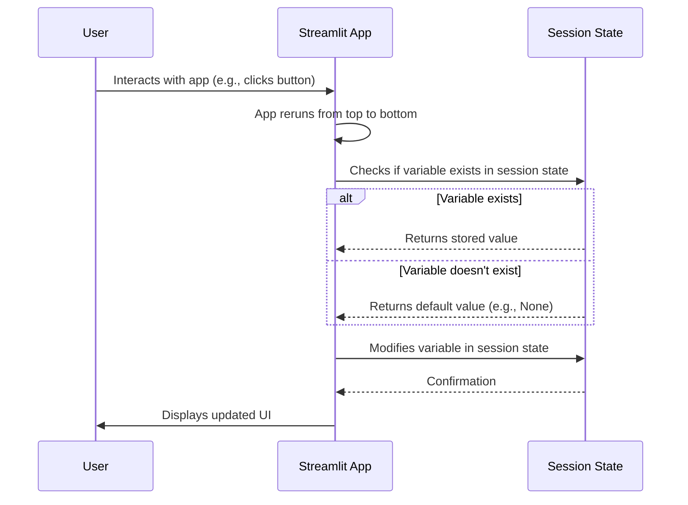

# Chapter 9: Session State Management

In the previous chapter, [Database Interaction](08_database_interaction.md), we learned how to save and retrieve product information using a database. Now, let's tackle another crucial aspect of our Streamlit application: remembering user interactions! This chapter is all about **Session State Management**.

Imagine you're browsing our product search app. You enter a search query, see the results, and then want to refine your search. Wouldn't it be annoying if the app forgot your original search every time you clicked a button? That's where session state management comes in – it's like giving our app a short-term memory!

**Why do we need Session State Management?**

Streamlit apps are unique because they rerun the entire script from top to bottom every time you interact with them (e.g., click a button, enter text). Without session state, the app would "forget" everything from the previous interaction! Session state management provides:

*   **Persistence Across Interactions:** It allows us to store data that persists between app reruns.
*   **Consistent User Experience:** It enables us to create a smooth and consistent user experience by remembering user inputs, search results, and selections.
*   **Avoiding Redundant Calculations:**  If you did a complex search, you don't want to repeat it every time. Session state lets us store the results and reuse them.

**Key Concepts**

Let's break down the key concepts behind Session State Management in Streamlit:

1.  **Session State:** This is a built-in Streamlit feature that allows us to store variables that persist across reruns of the app. Think of it as a dictionary that Streamlit automatically manages for us.

2.  `st.session_state`: This is the object we use to access the session state. It's like a special dictionary where Streamlit keeps track of the app's memory.

3.  **Keys:** Like a regular Python dictionary, the session state uses keys to identify the stored values. For example, we might use the key `'results'` to store the search results.

4.  **Initialization:** We often need to initialize session state variables before using them. This is like telling Streamlit, "Hey, I'm going to need a place to store the search results, so please create a variable called 'results' for me."

**Using Session State Management: A Practical Example**

Let's say we want to store the user's search query in the session state. Here's how we'd do it:

1.  **Initialize the Session State Variable:** We first check if the session state variable `'user_query'` already exists. If it doesn't, we create it and set its initial value to `None`.

    ```python
    import streamlit as st

    if 'user_query' not in st.session_state:
        st.session_state['user_query'] = None
    ```

    Explanation:
    * `if 'user_query' not in st.session_state:`:  This checks if a key named 'user_query' already exists in the session state dictionary.
    * `st.session_state['user_query'] = None`: If the key doesn't exist, this creates it and sets its initial value to `None`. This is like reserving a spot in the app's memory for the user's query.

2.  **Store the User's Input:** We use `st.text_input` to get the user's input, and then we store it in the session state variable `'user_query'`.

    ```python
    user_query = st.text_input("Enter your product query", key="user_query_input")

    if user_query != st.session_state['user_query']:
        st.session_state['user_query'] = user_query
    ```

    Explanation:
    * `user_query = st.text_input("Enter your product query", key="user_query_input")`: This creates a text input field where the user can type their search query. The `key="user_query_input"` is very important! It gives Streamlit a unique identifier to manage this input field across reruns.
    * `if user_query != st.session_state['user_query']:`: This condition prevents the application from rerunning unnecessarily when the value is identical. Without this check, the application would rerun every time there is any interaction, even if the query value remains unchanged.
    * `st.session_state['user_query'] = user_query`: This line stores the user's input in the session state variable `'user_query'`. Now, the app will remember the user's query even after a rerun.

3.  **Access the Stored Value:** We can now access the stored user query using `st.session_state['user_query']`.

    ```python
    if st.button("Search"):
        if st.session_state['user_query']:
            st.write(f"You searched for: {st.session_state['user_query']}")
        else:
            st.write("Please enter a search query.")
    ```

    Explanation:
    * `if st.button("Search"):`: Creates a button with the label "Search".
    * `if st.session_state['user_query']:`: Checks if there's a search query stored in the session state.
    * `st.write(f"You searched for: {st.session_state['user_query']}")`: Displays the stored search query.

**Example with Search Results**

Now, let's see how we can use session state to store and display search results:

1.  **Initialize the Session State Variable:** We create a session state variable called `'results'` to store the search results.

    ```python
    if 'results' not in st.session_state:
        st.session_state['results'] = []
    ```

2.  **Store the Search Results:** After performing the search (using the [Product Search Agent Core Logic](02_product_search_agent_core_logic.md)), we store the results in the session state variable `'results'`.

    ```python
    from main import process_query

    if st.button("Search"):
        if st.session_state['user_query']:
            st.write("Searching the internet for products...")
            st.session_state['results'] = process_query(st.session_state['user_query']) # assuming process_query returns results
    ```

    Explanation:
    *   `st.session_state['results'] = process_query(st.session_state['user_query'])`: This line calls the `process_query` function (from the [Product Search Agent Core Logic](02_product_search_agent_core_logic.md)) to perform the search, and then stores the results in the session state variable `'results'`.

3.  **Display the Search Results:** We retrieve the search results from the session state variable `'results'` and display them in the app.

    ```python
    if st.session_state['results']:
        st.write("Results:")
        for product in st.session_state['results']:
            st.subheader(product['name'])
            st.write(f"URL: {product['url']}")
            st.write(f"Summary: {product['summary']}")
            st.write("---")
    ```

    Explanation:
    *   `if st.session_state['results']:`: This checks if there are any search results stored in the session state.
    *   The `for` loop then iterates through the results and displays the product name, URL, and summary for each result.

**Internal Implementation**

Streamlit handles session state behind the scenes. When you access or modify `st.session_state`, Streamlit takes care of storing the data and making it available across reruns.

Here's a simplified sequence diagram:



Explanation:

1.  The **User** interacts with the Streamlit app (e.g., clicks a button, enters text).
2.  The **Streamlit App** reruns from top to bottom.
3.  The **Streamlit App** checks if a variable exists in the **Session State**.
4.  If the variable exists, the **Session State** returns the stored value to the **Streamlit App**. Otherwise it returns a default value.
5.  The **Streamlit App** potentially modifies a variable in the **Session State**.
6.  The **Session State** stores the updated data
7.  The **Streamlit App** displays the updated UI to the **User**.

No need to call any init function for `st.session_state`. `st.session_state` is a built-in dictionary-like object. Streamlit automatically creates and manages it for you. You can directly use it to store and retrieve data that persists across reruns.

**Conclusion**

In this chapter, we've learned about Session State Management in Streamlit and how it allows us to store data that persists across app reruns. We've seen how it enables us to create a smooth and consistent user experience by remembering user inputs and selections. Session State Management is the key to building interactive and stateful Streamlit apps!

There are no further chapters. Congratulations on completing this tutorial!


---

Generated by [AI Codebase Knowledge Builder](https://github.com/The-Pocket/Tutorial-Codebase-Knowledge)