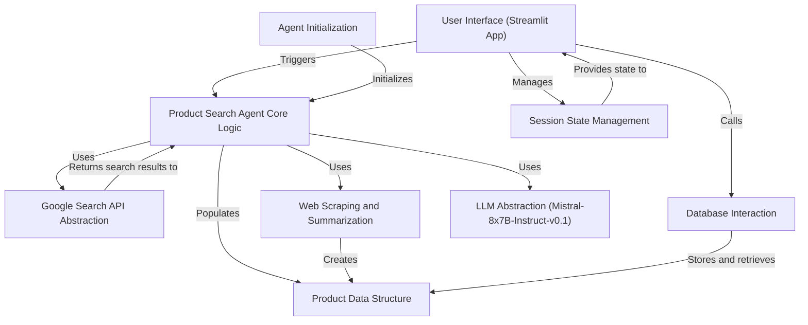

# Tutorial: result_of_tut

This project is an **autonomous product search agent**. *It helps users find products online* by taking their search queries, using the **Google Search API** to find websites, then using web scraping and **LLM summarization** to give a concise summary of the products. It also allows users to save product information to a database and manages everything through a user interface built with **Streamlit**.

**Source Repository:** [https://github.com/infilev/Search_Ai_agent](https://github.com/infilev/Search_Ai_agent)

## Chapters

1. [User Interface (Streamlit App)](01_user_interface__streamlit_app_.md)
2. [Product Search Agent Core Logic](02_product_search_agent_core_logic.md)
3. [Agent Initialization](03_agent_initialization.md)
4. [Google Search API Abstraction](04_google_search_api_abstraction.md)
5. [Web Scraping and Summarization](05_web_scraping_and_summarization.md)
6. [LLM Abstraction (Mistral-8x7B-Instruct-v0.1)](06_llm_abstraction__mistral_8x7b_instruct_v0_1_.md)
7. [Product Data Structure](07_product_data_structure.md)
8. [Database Interaction](08_database_interaction.md)
9. [Session State Management](09_session_state_management.md)

---

Generated by [AI Codebase Knowledge Builder](https://github.com/The-Pocket/Tutorial-Codebase-Knowledge)